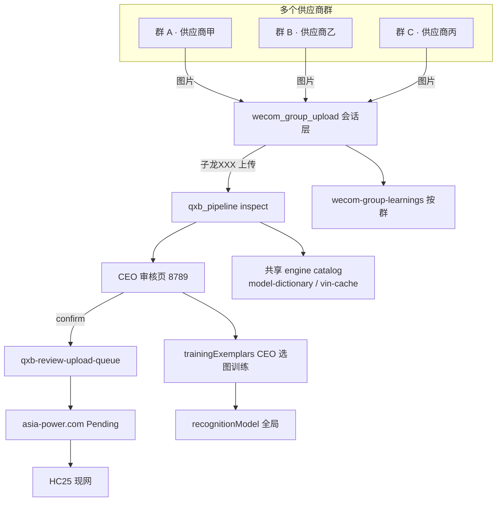

# 企业微信 · 子龙（APInventory）群内训练 Runbook

> 归档：2026-07-02  
> 目标：客户在**企业微信群**发图 + 说「上传」→ 子龙识别/建档 → CEO 审核 → 上线 asia-power.com  
> 相关代码：`integrations/wecom_group_upload.py`、`integrations/wecom_zijing_handler.py`

---

## 1. 结论（CEO 必读）

| 项目 | 说明 |
|------|------|
| **Phase A（本次 MVP）** | ✅ 群内收图 + 「子龙XXX 上传」→ 写入 QXB 相册 + 检查 → **等 CEO 审核，不自动发布** |
| **谁处理** | 子龙（`apinventory`）— 上传/库存/VIN 关键词已对齐 CLI 路由 |
| **一对多** | 每个群独立相册会话 + `config/wecom-group-suppliers.json` 映射供应商 |
| **CEO 必做** | 配置群 ChatId → 供应商；审核页 8789 确认后再上线 |
| **管理后台** | 应用需勾选接收 **图片消息**（不只文本） |

---

## 2. 客户在群里怎么用

```
步骤 1：在供应商群里直接发车辆照片（可多张，无需 @）
步骤 2：@AsiaPower 库存 Agent 说「子龙032 上传」
步骤 3：子龙回复 QXB0032 检查结果（VIN/发动机/阻塞项）
步骤 4：CEO 打开审核页确认 → 才会提交到网站 Pending
```

**常用话术：**

| 客户/CEO 说 | 子龙做什么 |
|-------------|-----------|
| （发照片） | 累计待处理相册，回复「已收到第 N 张」 |
| `子龙032 上传` | 把待处理照片写入第 32 行相册，跑检查 |
| `上传`（无行号） | 尝试推断行号；无法推断则提示指定行号 |
| `相册状态` / `子龙状态` | 显示当前群待处理张数 |
| `子龙003 确认可以上传` | 走原有 CEO 批准 live 流程（需先 inspect 通过） |

---

## 3. CEO 配置清单

### 3.1 绑定供应商群

1. 从回调日志或管理后台找到群 **ChatId**（形如 `wrXXXX`）
2. 复制 `config/wecom-group-suppliers.json.example` → `config/wecom-group-suppliers.json`
3. 填入 ChatId 与供应商名称（**不要提交到 git**）

```json
{
  "groups": {
    "wrYOUR_CHAT_ID": {
      "supplier_id": "supplier-xxx",
      "supplier_name": "XX汽配",
      "supplier_wechat": "wrYOUR_CHAT_ID"
    }
  }
}
```

### 3.2 企业微信管理后台

1. **AsiaPower 库存 Agent** → 接收消息 → 勾选 **图片**（及文本）
2. 白名单：`.env` 中 `WECOM_ALLOWED_CHAT_IDS=wr1,wr2,...`
3. 生产回调已部署：`https://asia-power.cn/wecom/callback`

### 3.3 CEO 审核（必做，宪法：不自动发布）

```bash
QXB_REVIEW_PORT=8789 node work/qxb-agent/review_server.js
# 浏览器 http://127.0.0.1:8789/review
```

群内上传只会 **inspect + 等审核**；CEO 点「确认上传」才进异步队列 → 网站 Pending → Admin 批准 → HC 上线。

---

## 4. 一对多架构



| 数据 | 隔离 vs 共享 |
|------|----------------|
| 群相册会话 `data/wecom/group-sessions.json` | **按群隔离** |
| 供应商映射 `config/wecom-group-suppliers.json` | **按群配置** |
| 群上传历史 `wecom-group-learnings.json` | **按群记录** |
| 发动机/VIN 知识库 | **全公司共享**（越训越准） |
| CEO 照片槽位训练 | **全局 recognitionModel**（CEO 判读为准） |

---

## 5. 分阶段路线图

| 阶段 | 内容 | 状态 |
|------|------|------|
| **Phase A** | 群内收图 + 上传指令 → QXB inspect → CEO 审核 | ✅ MVP 已实现 |
| **Phase B** | 发动机/VIN 从群图 OCR 自动成长；群级纠错反馈 | 🔜 接 OCR + upload-learnings |
| **Phase C** | 多群数据飞轮；自动 suggest 行号；供应商自助看状态 | 🔜 需 Dashboard |
| **Phase D** | 子敬无响应 failover → 孔明 | 📋 blueprint 已预留 |

---

## 6. 故障排查

| 现象 | 原因 | 处理 |
|------|------|------|
| 发图无回复 | 未开图片消息 / 群不在白名单 | 后台勾选图片；加 ChatId 到 `.env` |
| `@上传` 进了子敬 | 旧版路由（已修） | 确认代码含 `上传/qxb` 关键词 |
| 子龙说 Excel 无此行 | 行号与汽修宝导出不一致 | 核对 Excel 行号 |
| VIN decode 失败 | 生产 knowledge-base 未部署 | 见 qxb-batch-upload-runbook §3 |
| 想立刻上线 | 宪法禁止自动发布 | 必须 8789 + Admin 批准 |

---

## 7. 相关文档

- 企微部署：`data/knowledge-base/wecom-zijing-setup-runbook.md`
- QXB 批量上传：`data/knowledge-base/qxb-batch-upload-runbook.md`
- 蓝图 Phase 3：`docs/asia-power-v3-blueprint.md`
