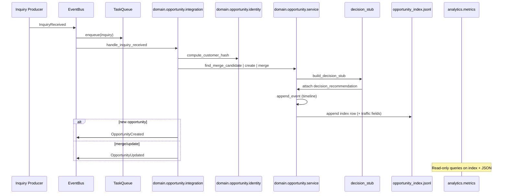
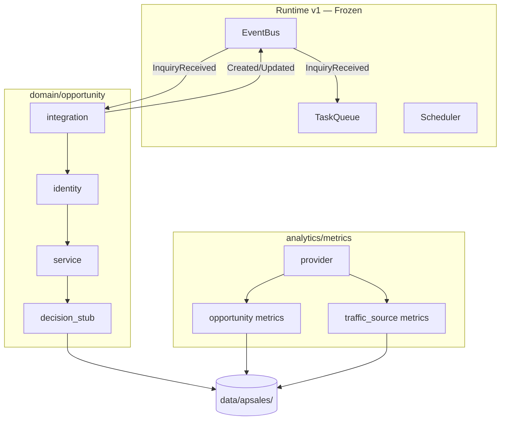

# APSALES-101 — Review Report (Revised)

**Task:** APSALES-101 — Opportunity Runtime Integration  
**Status:** **Revised — pending re-implementation** (docs approved; code must align)  
**Date:** 2026-07-05  
**Architecture Freeze:** Preserved

---

## Revision Context

CTO accepted the APSALES-101 direction with **seven required documentation changes**. This report reflects the **approved target architecture**. A prototype implementation (`75fd54ab`) used `services/` and `api/dashboard_provider.py`; the next code pass must migrate to the revised layout below.

**No code changes in this revision pass — documentation only.**

---

## 1. Architecture Summary

APSales Runtime v1 remains the orchestration layer. Opportunity integrates as a **domain module** (`domain/opportunity/`) with a **reusable analytics metrics layer** (`analytics/metrics/`).

| Principle | Revised result |
|-----------|----------------|
| Reuse before extend | Task Queue, Scheduler, Lifecycle **unchanged** |
| Domain-driven layout | Opportunity in `domain/opportunity/`, not generic `services/` |
| Analytics separation | Metrics reusable by CEO dashboard, reports, SEO ops |
| Opportunity adapts to Runtime | Single Event Bus handler registration |
| Low coupling | Remove `domain/` tree → Runtime still operational |
| No Decision Engine / UI / prompts | Confirmed — expanded stub only |

---

## 2. Runtime Flow (Revised)



---

## 3. File Tree (Approved Target)

```
domain/
└── opportunity/
    ├── identity.py
    ├── models.py
    ├── service.py
    ├── integration.py
    └── decision_stub.py

analytics/
├── provider.py
└── metrics/
    ├── opportunity.py
    └── traffic_source.py

data/apsales/
├── opportunities/OPP-*.json
├── opportunity_index.jsonl
└── decisions.jsonl

apsales_runtime/
├── events.py              # +OpportunityCreated, +OpportunityUpdated
└── service.py             # handler registration only

docs/cto/
├── apsales-101-analysis.md
├── apsales-101-review.md
└── apsales-101-test-plan.md
```

**Deprecated (prototype — to remove on re-implementation):**

- `services/opportunity_service.py`
- `services/opportunity_integration.py`
- `api/dashboard_provider.py`

---

## 4. Compatibility Analysis

| Area | Backward compatible? | Notes |
|------|---------------------|-------|
| Runtime startup | ✅ | Handler try/except; domain optional |
| Task Queue | ✅ | Unchanged enqueue first |
| Scheduler | ✅ | No changes |
| CRM / draft_queue | ✅ | No changes |
| Event Bus | ✅ | +2 event types; existing 9 unchanged |
| Prototype data | ⚠️ | `data/apsales/` JSON compatible; add decision_id fields on migrate |

---

## 5. Coupling Analysis

| Dependency | Direction | Removable? |
|------------|-----------|------------|
| `service.py` → `domain.opportunity.integration` | One lazy import | Yes |
| `domain.opportunity` → `apsales_runtime.events` | Publish only | Replace with callback injection |
| `analytics.metrics` → `domain.opportunity.service` | Read-only | Yes — metrics return zeros |
| `analytics.provider` → `analytics.metrics` | Composition | Independent of Runtime |

**Coupling score:** Low. Domain module has no import of Scheduler, Task Queue internals, or prompts.

---

## 6. Rollback Plan

```bash
# Revert implementation commit(s)
git revert 75fd54ab   # and any follow-up migration commits

# Remove runtime data
rm -rf data/apsales/

# Verify Runtime alone
.venv/bin/python3 -m unittest tests.test_apsales_runtime_foundation -v
python scripts/apsales-runtime.py --once --no-telegram
```

Documentation under `docs/cto/apsales-101-*.md` can remain — it describes approved design.

---

## 7. Risks

| Risk | Severity | Mitigation |
|------|----------|------------|
| Prototype/code doc drift | Medium | This revision aligns docs; re-implement to `domain/` |
| Hash collision on fallback tier | Low | Append `inquiry_id` when T4 only |
| Index growth | Low | JSONL append; compaction in ops task |
| Traffic fields missing on WhatsApp | Medium | Default `entry_channel=unknown`; APSALES-102 enriches |
| Dual event confusion | Low | Created vs Updated rules documented in test plan |

---

## 8. Remaining Work

### APSALES-101 re-implementation (code)

1. Move `services/*` → `domain/opportunity/*`
2. Replace `api/dashboard_provider.py` → `analytics/metrics/` + `analytics/provider.py`
3. Expand decision stub schema + `decisions.jsonl`
4. Add `OpportunityUpdated` event
5. Implement identity module per hashing strategy
6. Add traffic fields to Opportunity + traffic metrics
7. Execute [apsales-101-test-plan.md](./apsales-101-test-plan.md)

### APSALES-102 (after 101)

1. Gateway publishers for `InquiryReceived`
2. Decision Engine replaces stub
3. Follow-up Intelligence
4. Draft ↔ Opportunity linking

---

## 9. Lessons Learned

1. **Domain module beats generic `services/`** — clearer boundaries for AI-native sales OS.
2. **Analytics metrics ≠ dashboard** — reuse across CEO UI, SEO reports, Telegram digests.
3. **Created + Updated events** — downstream consumers need merge/update signals.
4. **Decision stub is an audit object** — needs identity fields before Decision Engine lands.
5. **Traffic on Opportunity** — bridges Objective 1 (Google traffic) to commercial objects early.

---

## Validation (Target — Post Re-implementation)

| Criterion | Target |
|-----------|--------|
| Inquiry → Opportunity | ✅ |
| Merge → `OpportunityUpdated` | ✅ |
| Create → `OpportunityCreated` | ✅ |
| Decision stub fields complete | ✅ |
| Customer hash tiers | ✅ |
| Traffic fields on Opportunity | ✅ |
| Analytics metrics JSON | ✅ |
| Runtime backward compatible | ✅ |
| Tests in test plan pass | ✅ |

---

## Architecture Diagram



---

## Rollback Method

| Step | Action |
|------|--------|
| 1 | `git revert` implementation commits |
| 2 | Delete `data/apsales/` |
| 3 | Remove `domain/`, `analytics/` if added |
| 4 | Run Runtime foundation tests |

---

## Related

- [apsales-101-analysis.md](./apsales-101-analysis.md)
- [apsales-101-test-plan.md](./apsales-101-test-plan.md)
- [apsales/apsales-100-sales-intelligence.md](./apsales/apsales-100-sales-intelligence.md)
