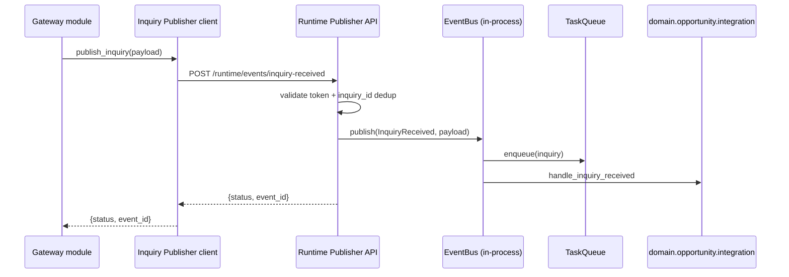
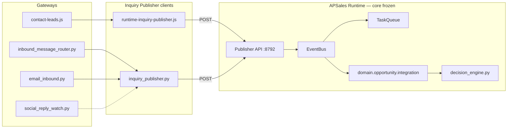

# APSALES-102 — Architecture Analysis (Revised)

**Task:** APSALES-102 — Gateway Publishers + Decision Engine (Minimum)  
**Status:** **Analysis revised — awaiting approval before coding**  
**Date:** 2026-07-05  
**Revision:** CTO approved v1 with **required change** — replace Outbox Bridge with **Runtime Publisher API**  
**Prerequisite:** APSALES-101 implemented locally (`76489479`, not pushed)  
**References:** [apsales-101-analysis.md](./apsales-101-analysis.md), [apsales/playbook-v1.md](./apsales/playbook-v1.md), [apsales/opportunity-model-v1.md](./apsales/opportunity-model-v1.md)

---

## Revision Note

| v1 (withdrawn) | v2 (this document) |
|----------------|-------------------|
| `inquiry_outbox.jsonl` + bridge worker poll | **Runtime Publisher HTTP API** on localhost |
| Node/Python append JSONL | Gateway → **Inquiry Publisher client** → `POST /runtime/events/inquiry-received` |
| `inquiry_bridge.py` in worker tick | **No outbox, no polling, no bridge worker** |

**Frozen target flow:**

```
Gateway
  → Inquiry Publisher (client)
  → Runtime API
  → EventBus.publish(InquiryReceived)
  → [existing APSALES-101 handlers unchanged]
```

---

## Executive Summary

APSALES-101 wired **consumption** of `InquiryReceived` inside the Runtime process. Production gateways still **never emit** that event — they write leads, drafts, and inbox files instead.

APSALES-102 closes the loop with two minimal deliverables:

1. **Gateway publishers** — each confirmed buyer inquiry calls a shared **Inquiry Publisher client**, which POSTs to a **Runtime Publisher API** that invokes the in-process `EventBus.publish(InquiryReceived, …)`.
2. **Decision Engine v0** — rule-based replacement for `decision_stub.py` after Opportunity create/merge (inventory hit → recommendation; no match → human required).

**No Runtime redesign.** Event Bus handlers, Scheduler, Task Queue, and worker loops stay unchanged. The Publisher API is a **thin additive ingress layer** — not a new event pipeline.

**Explicitly excluded:** JSONL outbox, outbox polling, bridge worker, async replay queue.

---

## Current State (Post APSALES-101)

| Layer | Today | Reaches `InquiryReceived`? |
|-------|-------|----------------------------|
| Runtime handler | `apsales_runtime/service.py` → `on_inquiry` | **Subscribes only** |
| Website forms | `POST /api/leads/*` → `contact-leads.js` | **No** |
| WhatsApp live | `inbound_message_router.py` → `save_draft()` | **No** |
| Email | `email_inbound.py` → `save_draft()` | **No** |
| Social replies | `social_reply_inbox.json` → draft scripts | **No** |
| Maps / outreach | Outbound prospecting only | **No** (inbound reply TBD) |
| Tests | Direct `EventBus.publish` | **Yes** |

**Gap:** Event Bus is **in-process**. Gateways run in Node or separate Python processes. APSALES-102 adds a **localhost Runtime API** so external processes can trigger the **same** publish path tests already use.

---

## Runtime Publisher Interface (Approved Target)

### Architecture



### Components (proposed — not yet implemented)

| Component | Location | Role |
|-----------|----------|------|
| **Runtime Publisher API** | `apsales_runtime/publisher_api.py` | Localhost HTTP server; sole path to external `InquiryReceived` |
| **Inquiry Publisher (Python)** | `customer_gateway/inquiry_publisher.py` | HTTP client + payload validation; used by WhatsApp, email, social |
| **Inquiry Publisher (Node)** | `server/lib/runtime-inquiry-publisher.js` | Same contract for website leads |
| **Config** | `config/apsales_runtime.yaml` → `publisher_api:` | Host, port, token env var, enable flag |

### API contract

**Endpoint:** `POST /runtime/events/inquiry-received`  
**Bind:** `127.0.0.1` only (never public nginx)  
**Auth:** `Authorization: Bearer ${APSALES_RUNTIME_PUBLISHER_TOKEN}` or `X-Runtime-Token` header

**Request body:**

```json
{
  "inquiry_id": "lead-a1b2c3d4e5f6",
  "channel": "web",
  "source": "contact-form",
  "payload": {
    "email": "buyer@shop.ng",
    "phone": "+233540911111",
    "engine": "G4KD",
    "landing_page": "/engines/hyundai-g4kd.html",
    "utm_source": "google",
    "draft_id": "draft-…"
  }
}
```

| Field | Required | Purpose |
|-------|----------|---------|
| `inquiry_id` | **Yes** | Idempotency key (see §3) |
| `channel` | Yes | `web`, `whatsapp`, `email`, `facebook`, `maps`, … |
| `source` | No | Finer-grained gateway label |
| `payload` | Yes | Passed verbatim to `EventBus.publish` (merged with `inquiry_id`, `channel`, `source`) |

**Response:**

```json
{ "ok": true, "status": "published", "event_id": "evt-abc123", "inquiry_id": "lead-…" }
```

```json
{ "ok": true, "status": "duplicate", "inquiry_id": "lead-…", "event_id": "evt-existing" }
```

**Errors:** `400` invalid payload · `401` bad token · `503` runtime not ready (bus not wired)

### Runtime API implementation rules

1. **Single publish path:** API handler calls `lifecycle.event_bus.publish(EVENT_INQUIRY_RECEIVED, merged_payload, source=f"gateway:{channel}")` — identical to in-process test publish.
2. **No new Event Bus types** — reuse `InquiryReceived` only.
3. **No worker changes** — API runs in a **daemon thread** started from `APSalesRuntimeService.run()` after `_wire_event_bus()`.
4. **No JSONL outbox** — synchronous request/response only.
5. **`--once` mode:** API **not started** (healthcheck-only runs); tests continue using direct `EventBus.publish`.

### Suggested defaults

| Setting | Value |
|---------|-------|
| Host | `127.0.0.1` |
| Port | `8792` (unused in repo; local only) |
| Token env | `APSALES_RUNTIME_PUBLISHER_TOKEN` |
| Enabled | `true` when daemon running |

Production: Runtime systemd unit and inventory-site Node process share localhost; token in `.env` on server.

---

## 1. Where Should `InquiryReceived` Be Published?

Publication happens **after** the gateway confirms a real buyer inquiry, via **Inquiry Publisher → Runtime API** (not direct EventBus access from gateways).

### 1.1 Website

| Entry point | File | Trigger |
|-------------|------|---------|
| Contact / engine form | `POST /api/leads/contact` | Lead saved → 201 |
| Half-cut enquiry | `POST /api/leads/half-cut` | Lead saved → 201 |
| Product / quote | `POST /api/leads/product` | Lead saved → 201 |
| WhatsApp intent | `POST /api/leads/whatsapp` | Lead saved → 201 |

**Hook:** `server/lib/contact-leads.js` — call `runtime-inquiry-publisher.js` after `saveJsonAtomic` succeeds.

**Payload mapping:**

| Field | Source |
|-------|--------|
| `inquiry_id` | `lead.id` |
| `channel` | `web` |
| `source` | `lead.source` |
| `email`, `phone`, `customer_name` | lead record |
| `engine` / `product` | `lead.engineCode`, `lead.product` |
| `landing_page`, `utm_*`, `referrer` | `lead-context.js` / lead meta |
| `country` | geo from `resolveClientGeo` |

**Skip when:** spam blocked, validation error, rate limit 429.

---

### 1.2 WhatsApp

| Entry point | File | Trigger |
|-------------|------|---------|
| Live inbox | `inbound_message_router.py` | After `save_draft()` succeeds |
| Business polling | `whatsapp_business_polling.py` | Same router |

**Hook:** `inbound_message_router.py` → `inquiry_publisher.publish_inquiry(…)` after draft.

| Field | Source |
|-------|--------|
| `inquiry_id` | `wa:{message_id}` |
| `channel` | `whatsapp` |
| `customer_hash`, `phone`, `customer_name` | `InboundMessage` |
| `message`, `engine`, `draft_id` | message + keywords + draft |

**Skip when:** classifier ignores, constitution blocks, message already in `processed_messages`.

---

### 1.3 Email

| Entry point | File | Trigger |
|-------------|------|---------|
| APSales process | `email_inbound.py` → `_process_apsales_email_thread` | After `save_draft()` |
| Webhook ingest | `email_webhook_handler.py` | **Do not publish** — store only |

**Hook:** `email_inbound.py` end of `_process_apsales_email_thread`.

| Field | Source |
|-------|--------|
| `inquiry_id` | `email:{thread_id}:{inbound_message_id}` |
| `channel` | `email` |
| `customer_hash`, `email`, `message`, `subject`, `draft_id` | thread + draft |

**Skip when:** apinventory/ceo route, test/bot filter, empty body.

**Autopilot:** `growth_autopilot.py` → `process_pending_emails()` — single hook in `email_inbound.py` only.

---

### 1.4 Future — Facebook / Maps Adapters

Publish only on **inbound buyer intent**, not outbound prospecting.

| Phase | Entry | When |
|-------|-------|------|
| **102a** | `apsales-social-reply-watch.py` → `_draft_follow_up` | Social reply promoted to draft |
| **102b** | Maps / outreach inbound reply handler (TBD) | Prospect replies to outreach |

| Field | Social example |
|-------|----------------|
| `inquiry_id` | `social:{platform}:{reply_id}` |
| `channel` | `facebook` / `instagram` / `x` |
| `entry_channel` | `social` |

**102 core scope:** Website + WhatsApp + Email. Social/maps in **102a/102b**.

---

## 2. Which Existing Modules Should Publish?

**Rule:** Gateways never call Runtime API directly. All go through **Inquiry Publisher** facade.

| Module | Role |
|--------|------|
| **`customer_gateway/inquiry_publisher.py`** (new) | Python client: validate → HTTP POST → handle duplicate/503 |
| **`server/lib/runtime-inquiry-publisher.js`** (new) | Node client: same contract |
| `server/lib/contact-leads.js` | Call Node publisher after lead persist |
| `customer_gateway/inbound_message_router.py` | Call Python publisher after draft |
| `customer_gateway/email_inbound.py` | Call Python publisher after draft |
| `scripts/apsales-social-reply-watch.py` | Call Python publisher (102a) |
| **`apsales_runtime/publisher_api.py`** (new) | Server: token check → dedup → `EventBus.publish` |

**Must NOT publish:**

| Module | Reason |
|--------|--------|
| `sales_core/apsales_handler.py` | Prompt/analysis — not ingress |
| `domain/opportunity/integration.py` | Consumer — emits Opportunity events only |
| `customer_gateway/draft_queue.py` | Storage layer |
| `social_autopilot.py`, `maps_prospect.py` | Outbound only |
| `apsales_runtime/worker.py` | **No publisher logic in worker** |

---

## 3. How Can Duplicate `InquiryReceived` Events Be Prevented?

No outbox replay — dedup is **synchronous at the Runtime API**.

### Layer A — Required `inquiry_id` (gateway)

Every publisher call includes a stable key:

| Source | `inquiry_id` format |
|--------|---------------------|
| Website | `lead.id` |
| WhatsApp | `wa:{message_id}` |
| Email | `email:{thread_id}:{inbound_message_id}` |
| Social | `social:{platform}:{reply_id}` |
| Maps | `maps:{place_id}:{correlation_id}` |

### Layer B — Runtime API idempotency (authoritative)

Before `EventBus.publish`:

```
if inquiry_id in publisher_idempotency_cache:
    return {status: "duplicate", event_id: cached_event_id}
else:
    event = bus.publish(...)
    cache[inquiry_id] = event.event_id
    return {status: "published", event_id: event.event_id}
```

**Storage:** Extend `data/apsales_runtime/state.json` with `publisher_idempotency: {inquiry_id: event_id}` (JSON map, **not** an event outbox). TTL purge optional (30 days) on Runtime startup.

**Not used:** `inquiry_outbox.jsonl`, `inquiry_dedup.jsonl`, bridge offsets.

### Layer C — Gateway-side guards (defence in depth)

| Mechanism | Channel |
|-----------|---------|
| `processed_messages.json` | WhatsApp — skip publish if already routed |
| Email `processedByApsales` + message id in key | Email |
| Lead `id` uniqueness | Website |

### Layer D — Publisher client behaviour

| Runtime response | Client action |
|------------------|---------------|
| `published` | Log success |
| `duplicate` | Treat as success (idempotent) |
| `503` / connection error | Log warning; **do not** write fallback queue; retry on next gateway poll (WhatsApp/email cron) |
| `400` | Log error; do not retry same bad payload |

### Downstream merge (unchanged)

Opportunity merge (same customer + engine, 7 days) remains in APSALES-101 — separate from ingress dedup.

---

## 4. Minimum Implementation to Replace Decision Stub

Unchanged from approved APSALES-102 scope — Decision Engine is **orthogonal** to the Publisher API.

### 4.1 Scope

| In scope | Out of scope |
|----------|--------------|
| `domain/opportunity/decision_engine.py` | Bundle / half-cut / alternative SKU |
| Inventory check via `check_inventory_for_enquiry` | Supplier score ranking |
| Update `decision_recommendation` + `decisions.jsonl` | Scheduler auto follow-up |
| `human_required` when confidence low | CEO Dashboard UI |

### 4.2 Minimum rules

| Condition | Output |
|-----------|--------|
| Inventory hit | `decision=match_inventory`, `status=completed`, `confidence≥0.7` |
| Miss + high urgency | `decision=supplier_search`, `human_required=true` |
| Else | `decision=await_more_info`, `human_required=true` |

### 4.3 Hook

`domain/opportunity/service.py` → `create()`: replace `build_decision_stub` with `run_decision_engine(opp)`.

**On merge:** keep existing `decision_id` unless engine/product changed (INT-DEC-003 preserved).

### 4.4 Output schema (extends stub)

```json
{
  "decision_id": "DEC-20260705-a1b2c3",
  "opportunity_id": "OPP-20260705-WA-a3f2b1",
  "timestamp": "2026-07-05T05:23:00+00:00",
  "status": "completed",
  "decision": "match_inventory",
  "confidence": 0.72,
  "human_required": false,
  "reason": "Inventory hit for G4KD",
  "recommendations": [],
  "gaps": []
}
```

No new Event Bus type `DecisionRecorded` in 102 — field update only.

---

## 5. Which Runtime Modules Remain Untouched?

### Frozen — no behavioural changes

| Module | Status |
|--------|--------|
| `apsales_runtime/events.py` | 11 event types unchanged |
| `apsales_runtime/service.py` → `on_inquiry` body | APSALES-101 handler frozen |
| `apsales_runtime/scheduler.py` | Unchanged |
| `apsales_runtime/task_queue.py` | Unchanged |
| `apsales_runtime/worker.py` | **Unchanged — no polling, no bridge** |
| `apsales_runtime/lifecycle.py` | Unchanged (except optional `event_bus` ref already set) |
| `apsales_runtime/memory.py` | Unchanged |
| `config/prompts.py` | Unchanged |
| `tools/crm_tool.py` | Unchanged |
| `domain/opportunity/integration.py` | Unchanged |
| `domain/opportunity/identity.py` | Unchanged |

### Additive only (102 allowed)

| Module | Change |
|--------|--------|
| **New** `apsales_runtime/publisher_api.py` | Localhost HTTP → `EventBus.publish` |
| `apsales_runtime/service.py` | Start/stop publisher API thread after `_wire_event_bus()` |
| `config/apsales_runtime.yaml` | `publisher_api:` section |
| `apsales_runtime/paths.py` | Optional — idempotency lives in existing `state.json` |

### Gateway / domain (new work)

| Module | Change |
|--------|--------|
| `customer_gateway/inquiry_publisher.py` | New client |
| `server/lib/runtime-inquiry-publisher.js` | New client |
| Gateway hooks | See §1–§2 |
| `domain/opportunity/decision_engine.py` | New |

---

## Proposed Implementation Phases (Post-Approval)

| Phase | Deliverable | Verification |
|-------|-------------|--------------|
| **102-0** | `publisher_api.py` + Python `inquiry_publisher.py` + config | POST → one EventBus event; duplicate POST → `duplicate` |
| **102-1** | Node `runtime-inquiry-publisher.js` + `contact-leads.js` hook | Form submit → Opportunity created |
| **102-2** | WhatsApp + Email hooks | Integration tests |
| **102-3** | Decision Engine v0 | INT-DEC-* updated |
| **102a/102b** | Social / Maps inbound | Manual + adapter tests |

---

## Risks & Mitigations

| Risk | Mitigation |
|------|------------|
| Runtime daemon not running | Publisher logs 503; WhatsApp/email cron retries; website lead still saved in JSON |
| Token leak | Localhost bind + env token; never expose via nginx |
| Duplicate if gateway bypasses publisher | Runtime API idempotency is authoritative |
| `--once` / tests without API | Tests use direct `EventBus.publish` (unchanged) |
| Push timing | 101+102 verified locally together before GitHub push |

---

## Architecture Diagram (Final)



---

## Related Documents

| Document | Purpose |
|----------|---------|
| [apsales-101-analysis.md](./apsales-101-analysis.md) | Opportunity consumer (done locally) |
| [apsales-101-test-plan.md](./apsales-101-test-plan.md) | Baseline — extend for 102 |
| [apsales-runtime-v1.md](./apsales-runtime-v1.md) | Runtime foundation boundaries |
| [apsales/playbook-v1.md](./apsales/playbook-v1.md) | Full Decision Engine (103+) |

---

**Status:** Revised analysis complete. **No code written.** Awaiting architecture approval → `apsales-102-test-plan.md` → implementation.
