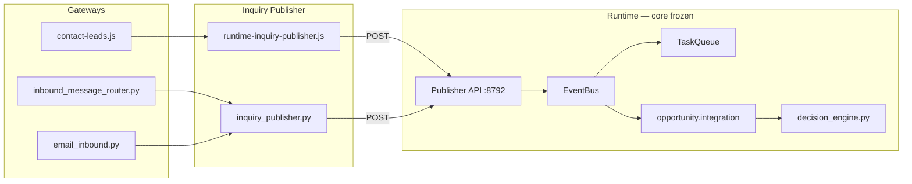

# APSALES-102 — Architecture Review (Approved)

**Task:** APSALES-102 — Gateway Publishers + Decision Engine (Minimum)  
**Status:** **Architecture approved — implementation not started**  
**Date:** 2026-07-05  
**Analysis reference:** [apsales-102-analysis.md](./apsales-102-analysis.md) (revised v2, approved as-is)

---

## 1. Why Runtime Publisher Replaces the Inquiry Outbox Proposal

The initial APSALES-102 analysis (v1) proposed a **file-based Outbox Bridge**:

```
Gateway → append inquiry_outbox.jsonl → worker poll → EventBus.publish
```

CTO review rejected this pattern. Reasons and the approved alternative:

| Concern with Outbox Bridge | Runtime Publisher response |
|----------------------------|----------------------------|
| **Indirect event path** — inquiries sit in a JSONL queue before reaching the Event Bus, creating a second pipeline parallel to Runtime | **Direct path** — one HTTP call maps 1:1 to `EventBus.publish(InquiryReceived)` |
| **Polling latency & complexity** — requires bridge drain in worker tick, offset tracking, replay semantics | **Synchronous** — gateway gets immediate `{published \| duplicate}` response |
| **Operational ambiguity** — hard to know if an inquiry is “stuck in outbox” vs “processed” | **Observable** — HTTP status codes; no hidden queue state |
| **Violates “Runtime owns events”** — outbox acted as an external event store | **Runtime API is the sole external ingress** — still in-process publish on the canonical bus |
| **Extra moving parts** — `inquiry_bridge.py`, dedup JSONL, worker changes | **Additive only** — thin API thread; worker loop unchanged |
| **Node/Python split** — both had to append the same JSONL format correctly | **Unified contract** — both call the same REST endpoint via Inquiry Publisher clients |

**Decision:** Gateways must not write event files. They call a **Runtime Publisher API** that invokes the existing in-process Event Bus. No JSONL event bridge, no outbox polling, no bridge worker.

---

## 2. Final Approved Architecture

### Target flow

```
Gateway (Website / WhatsApp / Email / future Social·Maps)
  → Inquiry Publisher (client facade)
  → Runtime Publisher API  (localhost HTTP)
  → EventBus.publish(InquiryReceived)
  → [frozen APSALES-101 chain]
       TaskQueue.enqueue("inquiry")
       domain.opportunity.integration.handle_inquiry_received
       OpportunityCreated | OpportunityUpdated
       decision_engine (APSALES-102 scope)
```

### Components

| Layer | Module (proposed) | Role |
|-------|-------------------|------|
| **Runtime ingress** | `apsales_runtime/publisher_api.py` | `POST /runtime/events/inquiry-received`; token auth; idempotency; calls `lifecycle.event_bus.publish` |
| **Runtime wiring** | `apsales_runtime/service.py` | Start API daemon thread **after** `_wire_event_bus()`; no change to `on_inquiry` body |
| **Python client** | `customer_gateway/inquiry_publisher.py` | Validate payload → HTTP POST → handle responses |
| **Node client** | `server/lib/runtime-inquiry-publisher.js` | Same contract for website leads |
| **Config** | `config/apsales_runtime.yaml` → `publisher_api:` | Host `127.0.0.1`, port `8792`, token env `APSALES_RUNTIME_PUBLISHER_TOKEN` |
| **Decision** | `domain/opportunity/decision_engine.py` | Replaces decision stub (orthogonal to publisher) |

### API contract (summary)

- **Endpoint:** `POST /runtime/events/inquiry-received`
- **Bind:** `127.0.0.1` only — never exposed via nginx
- **Auth:** Bearer / `X-Runtime-Token` from env
- **Required field:** `inquiry_id` (idempotency key)
- **Responses:** `published` | `duplicate` | `400` | `401` | `503`

### Idempotency (no outbox)

- **Authoritative dedup:** Runtime API checks `inquiry_id` before publish
- **Storage:** `publisher_idempotency` map in existing `data/apsales_runtime/state.json`
- **Not used:** `inquiry_outbox.jsonl`, `inquiry_dedup.jsonl`, bridge offsets

### Gateway publish points

| Channel | Hook location | When |
|---------|---------------|------|
| Website | `server/lib/contact-leads.js` | After lead persist (201) |
| WhatsApp | `customer_gateway/inbound_message_router.py` | After `save_draft()` |
| Email | `customer_gateway/email_inbound.py` | After `_process_apsales_email_thread` draft |
| Social / Maps | `102a` / `102b` | Inbound buyer reply only — deferred |

### Frozen Runtime core (unchanged)

- `apsales_runtime/events.py` — 11 event types
- `apsales_runtime/service.py` → `on_inquiry` handler body
- `apsales_runtime/scheduler.py`, `task_queue.py`, `worker.py`, `lifecycle.py`, `memory.py`
- `config/prompts.py`, `tools/crm_tool.py`
- `domain/opportunity/integration.py`, `identity.py`

### Explicit exclusions

- No JSONL event bridge
- No outbox polling
- No bridge worker
- No new Event Bus types for Decision Engine in 102
- No GitHub push until APSALES-101 + 102 verified locally together

### Architecture diagram



---

## 3. Impact on APSALES-102 Implementation

### Work items shifted by architecture change

| v1 plan (withdrawn) | v2 plan (approved) |
|---------------------|-------------------|
| `inquiry_outbox.jsonl` schema + append helpers | **Runtime Publisher API** + OpenAPI-like contract doc in test plan |
| `server/lib/inquiry-outbox.js` | **`server/lib/runtime-inquiry-publisher.js`** (HTTP client) |
| `apsales_runtime/inquiry_bridge.py` + worker tick hook | **`apsales_runtime/publisher_api.py`** + service thread start |
| Outbox drain integration tests | **API integration tests** (POST → EventBus → Opportunity) |
| Dedup via `inquiry_dedup.jsonl` | Dedup via **`state.json` publisher_idempotency map** |

### Implementation phases (updated)

| Phase | Deliverable | Verification |
|-------|-------------|--------------|
| **102-0** | Publisher API + Python `inquiry_publisher.py` + yaml config | Duplicate POST returns `duplicate`; valid POST creates Opportunity |
| **102-1** | Node client + `contact-leads.js` hook | Website lead → Runtime API → Opportunity |
| **102-2** | WhatsApp + Email hooks | End-to-end per channel |
| **102-3** | `decision_engine.py` replaces stub | INT-DEC-* migrated |
| **102a/102b** | Social / Maps inbound | After core 102 passes |

### Behaviour when Runtime is down

- Publisher receives connection error / `503`
- Gateway **logs warning** — lead/draft still saved in existing stores
- **No fallback queue** (no outbox)
- Retry on next gateway poll (WhatsApp/email cron) or manual reprocess
- Idempotency prevents double-publish on retry

### Test impact

- New test file: `tests/test_apsales_102_publisher_api.py` (proposed)
- Extend APSALES-101 integration tests with API ingress path
- `--once` mode: API not started; foundation tests unchanged (direct `EventBus.publish`)
- Test plan document (`apsales-102-test-plan.md`) required before coding — **not yet written**

### Dependency on APSALES-101

- APSALES-101 consumer chain is **complete locally** (`76489479`)
- APSALES-102 adds **ingress only** + decision engine
- No changes to Opportunity merge rules, identity hashing, or analytics metrics layer

### Deployment note (future)

- Runtime daemon must run alongside inventory-site Node process on production
- Shared `.env` token on `127.0.0.1:8792`
- Release Manager deploy after local 101+102 verification — **not in current scope**

---

## Sign-Off

| Gate | Status |
|------|--------|
| Analysis v2 (Runtime Publisher) | **Approved** |
| Outbox Bridge | **Rejected** |
| Implementation | **Not started — awaiting next CTO instruction** |
| `apsales-102-analysis.md` | **Frozen — do not regenerate** |

---

## Related

- [apsales-102-analysis.md](./apsales-102-analysis.md) — full analysis (approved reference)
- [apsales-101-review-final.md](./apsales-101-review-final.md) — Opportunity integration baseline
- [apsales-runtime-v1.md](./apsales-runtime-v1.md) — Runtime foundation boundaries
