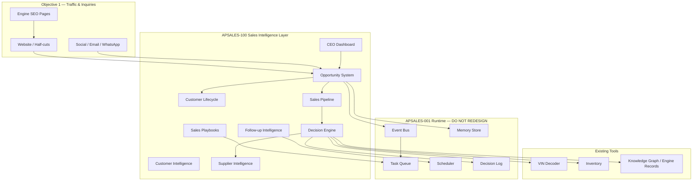
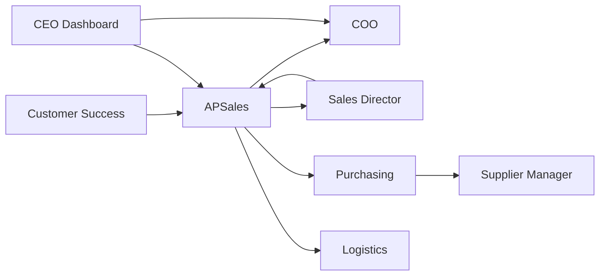

# APSALES-100 — Sales Intelligence Platform

**Task:** APSALES-100  
**Status:** Design Complete (no code, no deploy)  
**Date:** 2026-07-05  
**Layer:** AI Sales Intelligence (built on APSales Runtime v1)

---

## Purpose

Transform APSales from a **message-processing AI** into a complete **AI Sales Operating System (AI-SOS)** — the business intelligence, workflow, and commercial decision layer for a global automotive parts platform.

This phase defines **what to decide, when, and with what data**. It does not define prompts, UI implementation, or runtime redesign.

---

## Roadmap Alignment

Every component in this design maps to AsiaPower's two long-term objectives:

| Objective | How Sales Intelligence contributes |
|-----------|-----------------------------------|
| **1. Continuous Google traffic & inquiries** | Opportunity `Source` ties SEO/engine pages → `InquiryReceived`; pipeline stages drive content gaps back to SEO; playbooks standardize high-converting responses; dashboard tracks lead volume and response time |
| **2. 24/7 AI company with minimal human intervention** | Lifecycle + pipeline define AI vs human boundaries; Decision Engine automates match/quote recommendations; intelligent follow-up replaces fixed cron; Event Bus + Scheduler execute actions; CEO Dashboard surfaces exceptions only |

**Removed / deferred (does not serve objectives without extra justification):**

| Feature | Decision |
|---------|----------|
| Generic CRM fields with no decision use | Removed — replaced by Opportunity model |
| Fixed 24h/3d reminders only | Replaced by Follow-up Intelligence (context-driven) |
| Standalone social posting logic | Out of scope — stays in growth autopilot; SI layer consumes `InquiryReceived` only |

---

## Architecture Layer



---

## Document Map

| Document | Scope |
|----------|-------|
| [customer-lifecycle-v1.md](./customer-lifecycle-v1.md) | 12 lifecycle stages, entry/exit, AI/human/auto |
| [opportunity-model-v1.md](./opportunity-model-v1.md) | Opportunity entity, fields, IDs, events |
| [sales-pipeline-v1.md](./sales-pipeline-v1.md) | 10 pipeline stages, inputs/outputs, responsibilities |
| [dashboard-v1.md](./dashboard-v1.md) | CEO executive dashboard specification |
| [playbook-v1.md](./playbook-v1.md) | Playbooks, follow-up intelligence, customer & supplier intel |

---

## Decision Engine (Summary)

When a customer requests a product (e.g. **G4KD**):

```
Customer request
    ↓
Parse intent (engine / VIN / half-cut / budget)
    ↓
Inventory tool → platform-listed stock signals
    ↓
Supplier Intelligence → score ranked suppliers
    ↓
Historical Success → similar deals, win rate by SKU/country
    ↓
Knowledge Graph → applications, alternatives, confidence
    ↓
Recommend (with confidence + gaps):
  • Engine only
  • Engine + Gearbox bundle
  • Half-cut (custom dismantle)
  • Alternative engine (with reason)
    ↓
Human gate if: quote commit, delivery, payment, low confidence
```

Full rules: see §Decision Engine in [playbook-v1.md](./playbook-v1.md) and pipeline stage **Inventory Matching** in [sales-pipeline-v1.md](./sales-pipeline-v1.md).

**Output artifact:** `DecisionRecord` appended to `data/apsales_runtime/decisions.jsonl` (existing runtime log) + Opportunity field updates.

---

## AI Organization (Future State)

| Role | Responsibility | Interaction |
|------|----------------|-------------|
| **CEO Dashboard** | Exceptions, approvals, KPIs | Reads all opportunities; approves quotes/messages |
| **COO (APCOO)** | Policy, escalation, cross-agent routing | Receives HIGH/CRITICAL approvals; coordinates inventory + sales |
| **Sales Director** | Pipeline health, win/loss analysis, playbook updates | Sets stage SLAs; reviews lost opportunities |
| **Sales (APSales)** | Inquiry analysis, drafts, follow-up, opportunity updates | Primary owner of Opportunity through Negotiation |
| **Purchasing** | Supplier price confirmation, stock verification | Triggered at Supplier Matching / Quotation |
| **Supplier Manager** | Supplier score maintenance, SLA breaches | Updates Supplier Intelligence; handles complaints |
| **Logistics** | Shipping quotes, Incoterms, tracking | Active from Quotation → After-sales |
| **Customer Success** | Repeat orders, reactivation, after-sales | Owns Won → Dormant → Reactivated |



Human roles may remain partial until automation matures; AI responsibilities are defined per stage in linked docs.

---

## Integration with Existing Systems

| System | Integration point | Sales Intelligence use |
|--------|-------------------|------------------------|
| **Runtime v1** | Event Bus, Task Queue, Scheduler | Opportunities emit/consume events; follow-ups become scheduled tasks |
| **Memory** | `customer`, `conversation`, `supplier`, `learning` scopes | Opportunity links to customer hash; conversations append to opportunity timeline |
| **Knowledge Graph** | `knowledge/engines/*.json`, engine schema | Decision Engine reads confidence-scored facts for recommendations |
| **VIN** | `tools/vin_tool`, `/api/vin/decode` | Pipeline stage VIN Verification; lifecycle `VIN Pending` |
| **Inventory** | `tools/inventory_tool`, half-cut APIs | Matching stage; never claim stock without tool confirmation |
| **Website** | Engine pages, half-cut catalog, leads API | `Source=website`; attribution from `/api/analytics/event` |
| **Supplier Portal** | Upload, QXB workflow | Supplier Intelligence fed by upload quality, approval rate |
| **Engine Intelligence** | SEO pages, `docs/knowledge-schema.md` evidence model | Bridges traffic (objective 1) to qualified opportunities |

**Event Bus mapping (extends APSALES-001):**

| Event | Sales Intelligence action |
|-------|----------------------------|
| `InquiryReceived` | Create Opportunity → `Lead` |
| `CustomerCreated` | Link Customer Intelligence profile |
| `VINDecoded` | Advance lifecycle; update Opportunity VIN fields |
| `InventoryUpdated` | Re-run Decision Engine for open matches |
| `QuoteCreated` | Pipeline → Quotation; schedule intelligent follow-up |
| `QuoteApproved` | CEO approved — enable send task |
| `SupplierMatched` | Record supplier candidates + scores |
| `PaymentReceived` | Pipeline → Payment; update revenue fields |
| `ShipmentCreated` | After-sales handoff to Customer Success |

---

## Data Storage (Design — Not Implemented)

| Artifact | Proposed location | Notes |
|----------|-------------------|-------|
| Opportunities | `data/apsales/opportunities/{opp_id}.json` | One file per opportunity |
| Opportunity index | `data/apsales/opportunity_index.jsonl` | Append-only for dashboard queries |
| Customer intelligence | `memory/customers/{slug}.md` + structured overlay | Extends existing CRM |
| Supplier intelligence | `memory/suppliers/{slug}.md` + scores JSON | New structured fields |
| Pipeline snapshot | `memory/projects/sales_pipeline.md` | Legacy view; generated from opportunities |
| Decisions | `data/apsales_runtime/decisions.jsonl` | Reuse runtime |

---

## Migration from Today

| Current | Target |
|---------|--------|
| `sales_pipeline.md` 6 stages | 12 lifecycle stages + 10 pipeline stages |
| Draft queue only | Draft queue + Opportunity + DecisionRecord |
| Fixed scheduler rules | Follow-up Intelligence strategies |
| `crm_tool.py` flat stages | Opportunity model with revenue/probability fields |
| Admin progress pages | CEO Dashboard v1 spec |

---

## Deployment Impact

**None.** Design-only task.

---

## Rollback Impact

**None.** Documents only.

---

## Validation

Design review against APSALES-100 requirements: all 11 sections covered across 6 documents.

---

## Next Recommended Task

**APSALES-101 — Opportunity Schema Implementation**

Implement `data/apsales/` storage, Opportunity CRUD service, Event Bus hooks (`InquiryReceived` → create Opportunity), and migrate first pipeline read path from `sales_pipeline.md` — still **no prompts, no UI**.

---

## Related

- Runtime: `docs/cto/apsales-runtime-v1.md`
- Engineering Standard: `docs/architecture/ai-engineering-standard-v1.md`
- Growth / traffic: `docs/architecture/growth_map.md`
- Release Manager: `docs/cto/ops-005-release-manager.md`
