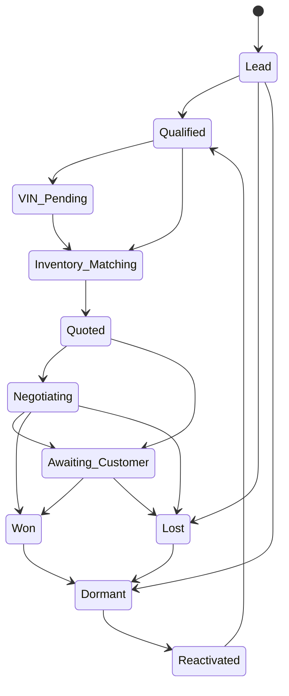

# Customer Lifecycle v1

**Task:** APSALES-100  
**Document:** customer-lifecycle-v1.md  
**Status:** Design

---

## Purpose

Define the **customer lifecycle** for AsiaPower's AI Sales OS. Lifecycle states describe **relationship status** (who the customer is in our system). Pipeline stages (see [sales-pipeline-v1.md](./sales-pipeline-v1.md)) describe **deal progress** (where a specific opportunity is).

One customer may have multiple opportunities in different lifecycle/pipeline states.

---

## Lifecycle Stages Overview

---

## Stage Definitions

### 1. Lead

| Dimension | Definition |
|-----------|------------|
| **Purpose** | Capture first contact; determine if inquiry is real and on-platform |
| **Entry** | First `InquiryReceived` (WhatsApp, email, website form, social DM, Maps outreach reply) |
| **Exit** | → `Qualified` if intent + contact valid; → `Lost` if spam/wrong industry; → `Dormant` if no engagement after nurture window |
| **AI** | Classify channel/source; extract country, product keywords, language; create Opportunity; draft acknowledgment (not auto-send) |
| **Human** | Approve/reject spam; override classification |
| **Automatic** | Create customer memory stub; emit `CustomerCreated`; index for dashboard "New Leads" |

---

### 2. Qualified

| Dimension | Definition |
|-----------|------------|
| **Purpose** | Confirm buyer intent, budget band, timeline, and fit for platform (not traditional exporter stock claim) |
| **Entry** | AI confidence ≥ 0.6 on buyer intent OR human marks qualified |
| **Exit** | → `VIN Pending` if VIN required; → `Inventory Matching` if SKU/engine code sufficient; → `Lost` if disqualified |
| **AI** | Run qualification checklist; update Opportunity probability; recommend next question set |
| **Human** | Confirm qualification on high-value or ambiguous leads |
| **Automatic** | Schedule qualification follow-up if customer stops replying (intelligent, not fixed 24h) |

---

### 3. VIN Pending

| Dimension | Definition |
|-----------|------------|
| **Purpose** | Obtain and decode VIN to confirm vehicle/application before matching |
| **Entry** | Customer needs fitment confirmation OR quote requires VIN evidence |
| **Exit** | → `Inventory Matching` on successful decode; → `Qualified` if VIN invalid but alternative path; → `Lost` if abandoned |
| **AI** | Request VIN politely; run VIN tool; map to engine/gearbox candidates via knowledge graph |
| **Human** | Handle decode failures, grey-market VINs, CEO-approved exceptions |
| **Automatic** | Emit `VINDecoded`; re-run Decision Engine; update Customer Intelligence preferred applications |

---

### 4. Inventory Matching

| Dimension | Definition |
|-----------|------------|
| **Purpose** | Match buyer demand to platform-listed inventory signals and supplier network |
| **Entry** | Sufficient product identity (engine code, half-cut type, or decoded VIN) |
| **Exit** | → `Quoted` when match set ready for pricing; → `Qualified` if need more info; → `Lost` if no supply path |
| **AI** | Inventory search; Decision Engine recommendations; supplier shortlist; internal analysis (ZH) |
| **Human** | Approve match when inventory ownership unclear; escalate missing stock |
| **Automatic** | Emit `SupplierMatched` when candidates ranked; notify Purchasing if SLA risk |

---

### 5. Quoted

| Dimension | Definition |
|-----------|------------|
| **Purpose** | Formal price/terms presented to customer (draft → CEO approval → send) |
| **Entry** | Quote draft created with line items, Incoterms sketch, validity date |
| **Exit** | → `Negotiating` on counter; → `Awaiting Customer` after send; → `Lost` if rejected |
| **AI** | Prepare quote structure; flag margin/risk; never commit final price without approval |
| **Human** | CEO approval required before external send (constitution) |
| **Automatic** | Emit `QuoteCreated`; start intelligent follow-up strategy "post-quote silence" |

---

### 6. Negotiating

| Dimension | Definition |
|-----------|------------|
| **Purpose** | Active price/terms discussion |
| **Entry** | Customer counter-offer or discount request |
| **Exit** | → `Awaiting Customer` after revised quote; → `Won` on accept; → `Lost` on walk-away |
| **AI** | Apply negotiation playbook; compute floor hints internally; draft responses |
| **Human** | Approve concessions, payment terms, delivery commitments |
| **Automatic** | Log each round to Opportunity timeline; update expected revenue/profit |

---

### 7. Awaiting Customer

| Dimension | Definition |
|-----------|------------|
| **Purpose** | Ball in customer's court — reduce premature chasing |
| **Entry** | Quote sent or question asked; no customer reply |
| **Exit** | → `Negotiating`/`Quoted` on reply; → `Won` on PO/payment intent; → `Lost`/`Dormant` on timeout |
| **AI** | Select follow-up strategy by urgency, value, and prior response speed |
| **Human** | Approve re-engagement messages; decide when to mark lost |
| **Automatic** | Scheduler tasks from Follow-up Intelligence (see [playbook-v1.md](./playbook-v1.md)) |

---

### 8. Won

| Dimension | Definition |
|-----------|------------|
| **Purpose** | Deal closed — revenue recognized or PO confirmed |
| **Entry** | Payment received OR signed PO per platform policy |
| **Exit** | → `Dormant` after fulfillment complete + no open tickets |
| **AI** | Trigger after-sales checklist; update Customer Intelligence value score |
| **Human** | Confirm non-standard deals; handle disputes |
| **Automatic** | Emit `PaymentReceived`; pipeline → Payment/Shipping; feed learning memory |

---

### 9. Lost

| Dimension | Definition |
|-----------|------------|
| **Purpose** | Closed-lost with reason for analytics and playbook improvement |
| **Entry** | Customer declined, competitor won, no supply, or explicit stop |
| **Exit** | → `Dormant` after cooling period; → `Reactivated` on inbound re-contact |
| **AI** | Capture loss reason code; suggest reactivation date if appropriate |
| **Human** | Validate loss reason on high-value deals |
| **Automatic** | Dashboard metrics; Sales Director weekly review queue |

---

### 10. Dormant

| Dimension | Definition |
|-----------|------------|
| **Purpose** | No active deal; preserve relationship for future GMV |
| **Entry** | Won fulfillment complete, lost cooling period, or long silence |
| **Exit** | → `Reactivated` on new inquiry or outbound campaign response |
| **AI** | Segment for reactivation campaigns (email/social — draft only) |
| **Human** | Approve reactivation outreach |
| **Automatic** | Reduce follow-up priority; retain Customer Intelligence |

---

### 11. Reactivated

| Dimension | Definition |
|-----------|------------|
| **Purpose** | Former customer or dormant lead re-engaged |
| **Entry** | New message after Dormant/Lost cooling period OR repeat buyer returns |
| **Exit** | → `Qualified` (skip Lead if known customer) |
| **AI** | Load full Customer Intelligence; apply repeat-customer playbook |
| **Human** | VIP handling for high LTV customers |
| **Automatic** | New Opportunity linked to prior history; higher initial probability score |

---

## Lifecycle vs Pipeline

| Lifecycle | Typical pipeline stages |
|-----------|-------------------------|
| Lead | Inquiry |
| Qualified | Qualification |
| VIN Pending | VIN Verification |
| Inventory Matching | Inventory Matching, Supplier Matching |
| Quoted | Quotation |
| Negotiating | Negotiation |
| Awaiting Customer | Negotiation (waiting) |
| Won | Payment, Shipping, After-sales |
| Lost | (terminal) |
| Dormant | (none active) |
| Reactivated | Inquiry → Qualification (accelerated) |

---

## AI vs Human Default Rules

| Risk | Lifecycle stages | Rule |
|------|------------------|------|
| Low | Lead, Dormant | AI drafts; human optional |
| Medium | Qualified, VIN Pending, Awaiting Customer | AI drafts; human approves external messages |
| High | Quoted, Negotiating | CEO approval for quotes and commitments |
| Critical | Won (payment/delivery) | Human confirmation required |

---

## Automatic Actions Summary

| Trigger | Action |
|---------|--------|
| Enter Lead | Create Opportunity, Customer memory, dashboard counter |
| Enter Quoted | `QuoteCreated` event + follow-up strategy |
| Enter Lost | Loss reason + playbook feedback hook |
| Enter Won | Update LTV, emit payment/shipment events |
| Dormant 90d+ | Eligible for reactivation strategy (human-approved) |

---

## Next

Implement lifecycle state machine in APSALES-101 tied to Opportunity model ([opportunity-model-v1.md](./opportunity-model-v1.md)).
