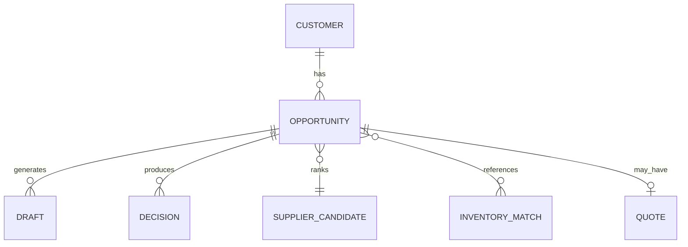

# Opportunity Model v1

**Task:** APSALES-100  
**Document:** opportunity-model-v1.md  
**Status:** Design

---

## Purpose

Every inquiry becomes an **Opportunity** — the single commercial object that powers pipeline, dashboard, decision engine, and follow-up intelligence.

One customer → many opportunities over time. Each opportunity has one primary lifecycle state and one pipeline stage.

---

## Opportunity ID

```
OPP-{YYYYMMDD}-{channel}-{seq6}
```

Example: `OPP-20260705-WA-a3f2b1`

| Segment | Meaning |
|---------|---------|
| `YYYYMMDD` | Creation date UTC |
| `channel` | WA, EM, WEB, FB, TG, MAP (2–3 char source code) |
| `seq6` | Random hex for uniqueness |

---

## Core Schema

```yaml
opportunity_id: string          # required, immutable
created_at: ISO8601
updated_at: ISO8601

# --- Parties ---
customer:
  customer_hash: string         # stable hash across channels
  customer_name: string
  country: string               # ISO or free text
  language: string              # en | fr | ar | zh
  contact_channels: []          # whatsapp | email | telegram

# --- Demand ---
vehicle:
  make: string
  model: string
  year: string
vin: string                     # empty until verified
engine: string                  # e.g. G4KD, 2NZ-FE
gearbox: string
half_cut: string                # slug or description
budget:
  amount: number
  currency: string              # USD default
  band: string                  # low | medium | high | unknown
urgency: string                 # low | medium | high | critical

# --- Commercial ---
probability: float              # 0.0–1.0 win probability
sales_stage: string             # lifecycle stage (see customer-lifecycle-v1)
pipeline_stage: string          # pipeline stage (see sales-pipeline-v1)
source: string                  # website | whatsapp | email | facebook | maps | referral
current_status: string          # human-readable one-liner
next_action: string             # AI-recommended next step
follow_up_at: ISO8601 | null    # intelligent scheduler, not fixed cron

expected_revenue: number
expected_profit: number
confidence_score: float         # 0.0–1.0 on data quality + match quality

# --- Matching ---
inventory_matches: []           # listing refs from inventory tool
supplier_candidates: []       # ranked supplier refs + scores
decision_recommendation: {}     # Decision Engine output snapshot

# --- Quote ---
quote:
  quote_id: string
  status: draft | pending_approval | sent | accepted | rejected
  sent_at: ISO8601
  valid_until: ISO8601
  total_usd: number

# --- Timeline ---
events: []                      # append-only opportunity events
draft_ids: []                   # links to customer_gateway draft_queue

# --- Outcome ---
outcome:
  result: open | won | lost | dormant
  loss_reason: string
  closed_at: ISO8601
  actual_revenue: number
```

---

## Field Definitions

| Field | Description | Source |
|-------|-------------|--------|
| **Opportunity ID** | Unique deal identifier | Generated at `InquiryReceived` |
| **Customer** | Buyer identity | CRM memory + gateway profiles |
| **Country** | Destination or buyer location | Message parse, VIN, or explicit |
| **Vehicle** | Make/model/year context | VIN decode or customer text |
| **VIN** | Verified VIN string | VIN tool; empty until stage allows |
| **Engine** | Primary engine code requested | Parse + knowledge graph normalize |
| **Gearbox** | Transmission if relevant | Parse or bundle recommendation |
| **Half-cut** | Half-cut SKU or type | Catalog slug when applicable |
| **Budget** | Stated or inferred budget band | Qualification |
| **Urgency** | Repair shop down vs browsing | Language + explicit deadline |
| **Probability** | P(win) this quarter | Model: stage + engagement + history |
| **Sales Stage** | Lifecycle enum | [customer-lifecycle-v1.md](./customer-lifecycle-v1.md) |
| **Pipeline Stage** | Process enum | [sales-pipeline-v1.md](./sales-pipeline-v1.md) |
| **Source** | Attribution for traffic objective | UTM, referrer, channel metadata |
| **Current Status** | e.g. "Waiting VIN from buyer" | AI summary |
| **Next Action** | e.g. "Send engine alternatives draft" | Decision Engine + playbook |
| **Follow-up Time** | Next intelligent touch | Follow-up Intelligence |
| **Expected Revenue** | GMV estimate USD | Quote or historical ASP |
| **Expected Profit** | Platform margin estimate | Internal only |
| **Confidence Score** | Overall deal data quality | VIN + inventory + supplier signals |

---

## Probability Model (Design)

Initial weights (tunable in APSALES-102):

| Factor | Weight hint |
|--------|-------------|
| Stage progression | +0.10 per advanced stage |
| Customer response speed | +0.05 if < 24h |
| VIN verified | +0.10 |
| Inventory match found | +0.15 |
| Repeat customer | +0.20 |
| No reply 7d post-quote | −0.25 |
| Supplier unavailable | −0.15 |

---

## Confidence Score (Design)

| Signal | Impact |
|--------|--------|
| VIN decoded with high confidence | +0.3 |
| Engine code in knowledge graph (confidence ≥ 0.8) | +0.2 |
| Inventory tool returned matches | +0.2 |
| Supplier score ≥ 0.7 | +0.2 |
| Missing budget + vague request | −0.3 |

---

## Opportunity Lifecycle Events

Append to `opportunity.events[]`:

```json
{
  "ts": "2026-07-05T04:00:00Z",
  "type": "stage_change",
  "from": "Lead",
  "to": "Qualified",
  "actor": "apsales",
  "note": "Engine G4KD confirmed for Tucson"
}
```

Sync with Runtime Event Bus where applicable.

---

## Relationship Diagram



---

## Creation Flow

```
InquiryReceived (Runtime Event Bus)
    ↓
Parse + dedupe by customer_hash + product fingerprint (24h window)
    ↓
New Opportunity OR merge into open Opportunity
    ↓
Set sales_stage=Lead, pipeline_stage=Inquiry
    ↓
Enqueue task: inquiry (Runtime Task Queue)
    ↓
CEO Dashboard: New Leads +1
```

---

## Merge Rules

| Condition | Action |
|-----------|--------|
| Same customer_hash + same engine + open < 7 days | Merge messages into one Opportunity |
| Same customer, different product | Separate opportunities |
| Repeat buyer new product | New Opportunity, link `prior_opportunity_ids` |

---

## Dashboard Projections

| Metric | Opportunity filter |
|--------|-------------------|
| New Leads | `sales_stage=Lead`, created today |
| Qualified | `sales_stage=Qualified` |
| Quotes Sent | `quote.status=sent` |
| Expected Revenue | sum(`expected_revenue`) where `outcome=open` |
| Urgent | `urgency=critical` OR `follow_up_at` overdue |

---

## Storage (Implementation Note)

```
data/apsales/opportunities/OPP-20260705-WA-a3f2b1.json
data/apsales/opportunity_index.jsonl   # denormalized for dashboard scans
```

Do not implement in APSALES-100 — specified for APSALES-101.

---

## Next

Wire Opportunity creation to `InquiryReceived` in APSALES-101.
