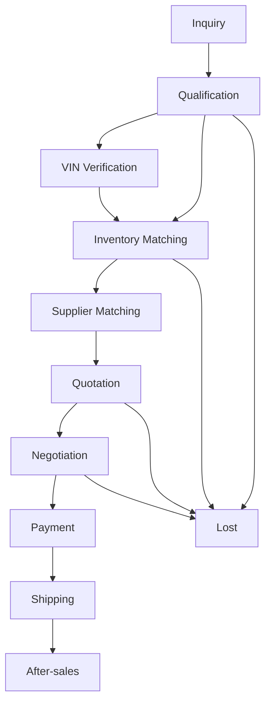

# Sales Pipeline v1

**Task:** APSALES-100  
**Document:** sales-pipeline-v1.md  
**Status:** Design

---

## Purpose

Define the **deal process pipeline** from first inquiry through after-sales. Pipeline stages describe **operational workflow**; lifecycle states (see [customer-lifecycle-v1.md](./customer-lifecycle-v1.md)) describe **customer relationship status**.

---

## Pipeline Overview

```
Inquiry
    ↓
Qualification
    ↓
VIN Verification
    ↓
Inventory Matching
    ↓
Supplier Matching
    ↓
Quotation
    ↓
Negotiation
    ↓
Payment
    ↓
Shipping
    ↓
After-sales
```



---

## Stage 1 — Inquiry

| | |
|--|--|
| **Inputs** | Raw message (WhatsApp/email/web), source metadata, referrer/UTM |
| **Outputs** | Opportunity created; `sales_stage=Lead`; parsed intent draft |
| **AI** | Channel detect; language detect; spam filter; create Opportunity; internal ZH analysis |
| **Human** | Spam override; VIP flag |

**SLA target:** First internal analysis < 15 minutes (24/7 runtime).

---

## Stage 2 — Qualification

| | |
|--|--|
| **Inputs** | Opportunity with product keywords; customer profile if exists |
| **Outputs** | `sales_stage=Qualified`; budget band; urgency; qualification gaps list |
| **AI** | Question checklist (engine vs VIN vs half-cut); update probability |
| **Human** | Confirm B2B vs retail; country compliance flags |

**Exit criteria:** Intent clear + contact valid + platform-fit confirmed.

---

## Stage 3 — VIN Verification

| | |
|--|--|
| **Inputs** | VIN string or request to obtain VIN |
| **Outputs** | Decoded vehicle; engine/gearbox candidates; `VINDecoded` event |
| **AI** | VIN tool lookup; map to knowledge graph; suggest alternatives if decode partial |
| **Human** | Manual decode edge cases; approve fitment without VIN (policy) |

**Skip path:** Engine-code-only buyers (e.g. "G4KD price") may skip to Inventory Matching.

---

## Stage 4 — Inventory Matching

| | |
|--|--|
| **Inputs** | Engine/half-cut/VIN-derived SKU; budget band |
| **Outputs** | `inventory_matches[]`; ownership labels (platform-listed / supplier-network / unknown) |
| **AI** | Inventory tool search; never claim AsiaPower owns stock without confirmation |
| **Human** | Escalate when inventory policy ambiguous |

**Platform rule:** Default wording = verified supplier network unless inventory tool confirms specific listing.

---

## Stage 5 — Supplier Matching

| | |
|--|--|
| **Inputs** | Product spec; destination country; urgency |
| **Outputs** | Ranked `supplier_candidates[]`; `SupplierMatched` event; internal cost hints |
| **AI** | Supplier Intelligence scores; request quotes from Purchasing workflow |
| **Human** | Supplier Manager assigns primary supplier on large deals |

**SLA target:** Supplier shortlist within 4h business / 24h overall.

---

## Stage 6 — Quotation

| | |
|--|--|
| **Inputs** | Match set; supplier pricing; shipping sketch; Incoterms template |
| **Outputs** | Quote draft; `QuoteCreated`; `quote.status=draft` |
| **AI** | Structure line items; margin check; customer-facing draft (EN/FR/AR) |
| **Human** | CEO approval before send; final price authority |

**Constitution gate:** `approval_required: final_quote, external_message`

---

## Stage 7 — Negotiation

| | |
|--|--|
| **Inputs** | Customer counter; competitor mention; payment term requests |
| **Outputs** | Revised quotes; negotiation round log; updated expected revenue |
| **AI** | Playbook-driven responses; internal floor guidance (not exposed) |
| **Human** | Approve discounts, payment terms, delivery dates |

---

## Stage 8 — Payment

| | |
|--|--|
| **Inputs** | Accepted quote; PO or payment proof |
| **Outputs** | `PaymentReceived`; `outcome=won`; revenue fields populated |
| **AI** | Payment reminder follow-ups; invoice draft checklist |
| **Human** | Confirm funds; fraud check |

---

## Stage 9 — Shipping

| | |
|--|--|
| **Inputs** | Paid order; supplier release; logistics quote |
| **Outputs** | Shipment plan; `ShipmentCreated`; tracking refs |
| **AI** | Status update drafts to customer; delay detection |
| **Human** | Logistics confirms booking; customs docs |

---

## Stage 10 — After-sales

| | |
|--|--|
| **Inputs** | Delivered shipment; customer feedback |
| **Outputs** | Case closed; Customer Intelligence updated; repeat-buyer signals |
| **AI** | Satisfaction check; cross-sell scan (new Opportunity if interest) |
| **Human** | Warranty claims; complaints → Supplier Intelligence |

---

## Pipeline Metrics (CEO Dashboard)

| Metric | Definition |
|--------|------------|
| Average Response Time | Inquiry → first CEO-approved reply sent |
| Average Quote Time | Inquiry → quote sent |
| Conversion Rate | Won / (Won + Lost) rolling 90d |
| Stage funnel | Count per pipeline stage |

---

## Stage Inputs/Outputs Matrix

| Stage | Primary Input | Primary Output | Runtime Event |
|-------|---------------|----------------|---------------|
| Inquiry | Message | Opportunity | `InquiryReceived` |
| Qualification | Opportunity | Qualified record | — |
| VIN Verification | VIN | Decode result | `VINDecoded` |
| Inventory Matching | SKU | Match list | `InventoryUpdated` |
| Supplier Matching | Spec | Supplier ranks | `SupplierMatched` |
| Quotation | Pricing | Quote draft | `QuoteCreated` |
| Negotiation | Counter | Revised quote | — |
| Payment | PO/payment | Won deal | `PaymentReceived` |
| Shipping | Order | Tracking | `ShipmentCreated` |
| After-sales | Delivery | LTV update | — |

---

## Integration with Runtime Task Queue

| Pipeline stage | Task type |
|----------------|-----------|
| Inquiry | `inquiry` |
| Qualification | `follow_up` |
| Quotation sent | `reminder` (intelligent) |
| Supplier delay | `follow_up` |
| Payment pending | `reminder` |
| Failed tool call | `retry` |

---

## Comparison to Current `sales_pipeline.md`

| Current (6 stages) | Pipeline v1 |
|--------------------|---------------|
| Lead | Inquiry + Qualification |
| Qualified | Qualification |
| Quoted | Quotation |
| Negotiating | Negotiation |
| Won | Payment + Shipping + After-sales |
| Lost | Terminal at any stage |

Migration: generate legacy markdown view from Opportunity index for backward compatibility.

---

## Next

Implement pipeline stage transitions in APSALES-101 with Decision Engine hooks at Matching stages.
