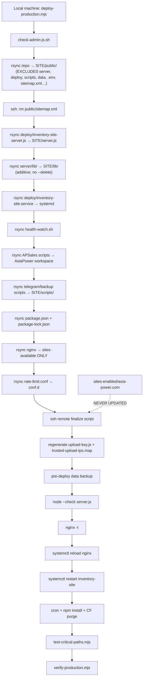

# OPS-002A — Root Cause Investigation

Date: 2026-07-05 (UTC)

Continues from: `docs/cto/ops-002-baseline-audit.md`  
Mode: **READ ONLY** — no fix, no commit, no push, no deploy, no file modification

Purpose: reconstruct **HOW and WHY** configuration drift happened — not merely **WHAT** differs.

Evidence sources used:

- Git history with commit timestamps (`git log --format="%h %ci %s"`)
- Production file mtimes (`stat`)
- Production nginx backup chain (`/etc/nginx/sites-available/asia-power.com.bak-*`)
- TASK-008 deploy log (`docs/cto/task-008-deploy-execution.log`)
- MD5 comparisons (OPS-002)
- `grep require` import tracing on production `server.js` + `lib/`
- Full read of `scripts/deploy-production.mjs`

Where mechanism cannot be proven, marked **unknown** (not guessed).

---

## 1. Executive Summary

Drift was caused by **three independent failure modes** operating together:

| # | Failure mode | Result |
| --- | --- | --- |
| 1 | **Deploy script never activates nginx vhost** | `sites-available` updated by rsync; `sites-enabled` (what nginx loads) left stale or manually maintained |
| 2 | **Production hotfixes applied outside GitHub** | Server-side nginx edits (Jul 1–2) + partial deploys from unpushed local commits (Jul 3–4) |
| 3 | **TASK-008 deploy from GitHub `8536a1d5` regressed rate-limit** | Jul 5 rsync restored Version A rate-limit while Version B+ vhost still active → `nginx -t` FAIL |

**Active today:**

- nginx process: **running stale in-memory config** since 2026-06-30 (reload blocked)
- `sites-enabled`: **Version B+** (upload zone + WeCom + resolver) — **active on disk for next reload attempt**
- `rate-limit.conf`: **Version A** (no upload zone) — **would apply on reload** → conflict
- `server.js`: **GitHub 8536a1d5** — **active**
- Many `lib/` files on disk: **orphaned** (deployed by rsync but not imported by active `server.js`)

---

## A. nginx Drift — Root Cause Reconstruction

### The four files are four different generations

| File | Version | md5 / lines | Role |
| --- | --- | --- | --- |
| `deploy/nginx-asia-power.com` (local git) | **B** | `d4e87170`, 372 lines | Intended repo truth (unpushed) |
| `origin/main` nginx vhost | **A** | `575ea847`, 342 lines | GitHub truth |
| `/etc/nginx/sites-available/asia-power.com` | **A** | `575ea847`, 342 lines | Deploy write target; **not loaded** |
| `/etc/nginx/sites-enabled/asia-power.com` | **B+** | `c852dc34`, 380 lines | **nginx actually loads this** |
| `deploy/nginx-rate-limit.conf` (local git) | **B** | upload zone present | Intended repo truth (unpushed) |
| `/etc/nginx/conf.d/asiapower-rate-limit.conf` | **A** | 216 B, 3 lines | **loaded by nginx**; missing upload zone |

### Feature matrix (evidence from grep + backups)

| Feature | Version A (GitHub / sites-available) | Local git `b59a44c5` | bak-wecom Jul 1 | sites-enabled Jul 2 (active) |
| --- | ---: | ---: | ---: | ---: |
| `asiapower_upload` (4 locations) | 0 | 4 | **4** | **4** |
| `/api/half-cuts/submissions` | no | yes | **yes** | **yes** |
| `/wecom/callback` | no | **1** | 0 | **1** |
| `resolver` + R2 `$r2_host` proxy | no | 0 | 0 | **2** |

**Conclusion:** active nginx config = **Version B** (upload routes) + **production-only patches** (resolver/R2) + **WeCom** (matches local git, not bak-wecom).

---

### A.1 `asiapower_upload` upload rate-limit zone

| Question | Answer |
| --- | --- |
| **When first appeared?** | **2026-07-01 13:24 UTC** — first proven in `asia-power.com.bak-wecom-202607011324` (4 refs). Absent in Jun 22 / Jun 30 backups. Local git documents same change in **`b59a44c5` dated 2026-07-03 06:35 UTC** (committed after server already had it). |
| **How introduced?** | **Not via deploy script to sites-enabled.** Evidence: deploy script only rsyncs to `sites-available` (since baseline commit `f445af42`, 2026-06-20). Upload zone first appears in a **manual server backup** (`cp` pattern: `.bak-wecom-*` naming). Mechanism that copied Version B into **`sites-enabled`**: **unknown** (not deploy script; likely manual `cp`/`rsync`/`vim` on server between Jul 1–2). |
| **Still active?** | **Yes** — referenced in active `sites-enabled` (4 `limit_req zone=asiapower_upload`). **Dead on disk** in `rate-limit.conf` (zone definition removed Jul 5). nginx process still running pre-Jul-5 memory state. |

---

### A.2 `/api/half-cuts/submissions` route

| Question | Answer |
| --- | --- |
| **When first appeared?** | **2026-07-01 13:24 UTC** (bak-wecom). Added in local git **`b59a44c5` (2026-07-03)**. |
| **How introduced?** | Same path as upload zone — **server-side nginx edit** with manual backup, then propagated to **`sites-enabled`**. Not in deploy script. |
| **Still active?** | **Yes** in `sites-enabled`. **No** in GitHub / `sites-available`. |

---

### A.3 `/wecom/callback` route

| Question | Answer |
| --- | --- |
| **When first appeared?** | **Between 2026-07-01 13:24 and 2026-07-02 09:02 UTC** — absent in bak-wecom; present in `sites-enabled` (mtime Jul 2). Present in local git **`b59a44c5` (2026-07-03)**. |
| **How introduced?** | **Unknown exact tool** — must have been added to the file that became `sites-enabled` after Jul 1 backup. Aligns with unpushed local nginx git content; **not** from GitHub deploy. |
| **Still active?** | **Yes** in `sites-enabled` (nginx would route to `127.0.0.1:8791` on successful reload). **No** in GitHub / `sites-available`. |

---

### A.4 R2 `resolver` + variable `proxy_pass`

| Question | Answer |
| --- | --- |
| **When first appeared?** | **2026-07-02 09:02 UTC** (`sites-enabled` mtime). **Absent** from all nginx backups and **absent** from local git `deploy/nginx-asia-power.com`. |
| **How introduced?** | **Production-only manual edit** (only file containing resolver is `sites-enabled`). Not deploy script. Not in any git commit checked. |
| **Still active?** | **Yes** in active `sites-enabled`. **Nowhere else.** |

---

### A.5 `sites-enabled` ≠ `sites-available` split

| Question | Answer |
| --- | --- |
| **When first appeared?** | **`sites-enabled` last written 2026-07-02 09:02** (uid `501:staff`). **`sites-available` last written 2026-07-05 03:28** by TASK-008 deploy rsync. |
| **How introduced?** | **Structural:** deploy script **always** rsyncs only to `sites-available` (line 94). **`sites-enabled` is a standalone file**, not a symlink (verified: regular file in `/etc/nginx/sites-enabled/`). Jul 2: active vhost updated independently. Jul 5: deploy updated inactive copy only. |
| **Still active?** | **Split is live.** nginx includes `sites-enabled/*` only (`nginx.conf` line 60). `sites-available` changes from Jul 5 deploy **have zero runtime effect** until someone copies or symlinks. |

---

### A.6 `rate-limit.conf` regression (trigger for `nginx -t` FAIL)

| Question | Answer |
| --- | --- |
| **When first appeared?** | **2026-07-05 03:28 UTC** — file birth/mtime on production; TASK-008 deploy log shows rsync of Version A from `8536a1d5`. |
| **How introduced?** | **`deploy-production.mjs` rsync** (line 95) from clean worktree at GitHub commit lacking upload zone. Remote finalize reached `nginx -t` → failed (documented in `task-008-deploy-execution.log`). |
| **Still active?** | **Yes on disk** — Version A is what `nginx -t` reads. **Conflict is active.** nginx process has **not** reloaded since failure. |

---

### A.7 Where did active nginx configuration come from?

| Source | Ruled in/out | Evidence |
| --- | --- | --- |
| **deploy script → sites-available** | Partial — writes inactive file | Lines 93–95; Jul 5 mtime on sites-available |
| **deploy script → sites-enabled** | **Ruled out** | Zero references in any commit of `deploy-production.mjs` |
| **rsync to sites-enabled** | **Possible but unlogged** | Jul 2 file owner uid `501` (Mac rsync pattern) — same uid as deploy rsync to sites-available |
| **manual `cp` / `vim`** | **Likely** | Backup naming convention `.bak-wecom-*`; edits between backups |
| **another script** | Only `install-wecom-domestic.sh` touches `sites-enabled` — for **asia-power.cn**, not `.com` | Different domain |

**Best supported conclusion:** active vhost is the result of **manual server-side nginx maintenance (Jul 1–2)** using Version B upload routes, plus **production-only resolver patch**, **not** the standard deploy pipeline.

---

## B. Deploy Pipeline — Actual Flow

### B.1 Source of truth in script

File: `scripts/deploy-production.mjs` (274 lines local / 205 lines GitHub `8536a1d5`)

Remote root: `root@159.65.86.24:/root/.openclaw/workspace/inventory-site`

### B.2 Deployment flow (evidence-based)



### B.3 Every path copied TO production (by design)

| Step | Source (local) | Destination (production) |
| --- | --- | --- |
| Static site | repo root (minus EXCLUDES) | `…/inventory-site/public/` |
| Node entry | `deploy/inventory-site-server.js` | `…/inventory-site/server.js` |
| Node libs | `server/lib/` | `…/inventory-site/lib/` |
| systemd | `deploy/inventory-site.service` | `/etc/systemd/system/inventory-site.service` |
| health watch | `deploy/health-watch.sh` | `/usr/local/bin/asiapower-health-watch.sh` |
| APSales py | selected `scripts/` + `customer_gateway/` | `…/AsiaPower/` |
| ops scripts | `deploy/inventory-site-scripts/backup-*` + telegram scripts + fix scripts | `…/inventory-site/scripts/` |
| npm manifest | `package.json`, `package-lock.json` | `…/inventory-site/` |
| R2 cors helper | `scripts/setup-r2-cors.mjs` | `…/inventory-site/scripts/` |
| nginx vhost | `deploy/nginx-asia-power.com` | `/etc/nginx/sites-**available**/asia-power.com` |
| rate limit | `deploy/nginx-rate-limit.conf` | `/etc/nginx/conf.d/asiapower-rate-limit.conf` |
| upload IP example | `deploy/asiapower-trusted-upload-ips.map.example` | `…/inventory-site/deploy/` |
| Remote-generated | `.env` secrets | `public/supplier-portal/upload-key.js` |
| Remote-generated | `TRUSTED_SUPPLIER_UPLOAD_IPS` | `/etc/nginx/conf.d/asiapower-trusted-upload-ips.map` |

### B.4 Explicitly NOT deployed (EXCLUDES + omissions)

| Category | Examples | Why |
| --- | --- | --- |
| EXCLUDES block | `server/`, `deploy/`, `scripts/` (most), `data/`, `.env`, Python trees | Prevent leaking backend / secrets into `public/` |
| Never referenced | `/etc/nginx/sites-enabled/` | **Design gap** — script assumes sites-available is enough |
| Deleted on deploy | `public/sitemap.xml` | Production uses dynamic Node `/sitemap.xml` |
| Runtime data | `uploads/`, `data/` on server | Never rsync'd (correct) |

### B.5 Why `sites-enabled` is never synchronized

**Direct evidence:** lines 93–95 only target `sites-available`. Grep across entire repo history back to `f445af42` (2026-06-20): **zero** `sites-enabled` references in `deploy-production.mjs`.

**Why drift persists:**

1. Debian/nginx convention expects `sites-enabled` → symlink to `sites-available`.
2. This server uses a **detached copy** in `sites-enabled` (not symlink).
3. Deploy updates the **inactive** file.
4. Manual ops updated the **active** file separately (Jul 1–2).

**Jul 4 evidence deploy finalize ran:** `asiapower-trusted-upload-ips.map` mtime **2026-07-04 20:06 UTC** — file is **only** written inside remote finalize script (lines 131–137). Proves a deploy reached that step on Jul 4; whether `nginx -t` passed that day is **not logged**.

---

## C. server.js Evolution

### C.1 Size evidence

| Copy | Lines | Bytes | md5 |
| --- | ---: | ---: | --- |
| **Production** (active) | 920 | 37,051 | `7808ecc…` |
| **GitHub `origin/main`** | 920 | 37,051 | `7808ecc…` |
| **Local feature** (modified) | 1,746 | 70,263 | `0426e13b…` |

Production **equals GitHub**. Local is **+826 lines (+90%)** — uncommitted / unpushed working tree changes on top of commits not on GitHub.

### C.2 Functional diff (Local vs GitHub/Production)

No line-by-line code — classified by behavior:

| Category | Present on production? | Local additions (vs GitHub) |
| --- | --- | --- |
| **API — Email** | **No** | `/api/email/inbound`, `/api/email/send`, `/api/email/health`, `/api/email/threads` + `email-proxy.js`, `email-outbound.js`, `email-mailbox.js` wiring |
| **API — APSales** | **No** | `/api/apsales/distribution-progress`, `/api/apsales/zijing-live-status` + Python spawn helpers |
| **API — Search** | **No** | `/api/search/record`, `/api/search/trending` |
| **API — Shipping** | **No** | `/api/shipping/ports`, `/geo-hint`, `/cif-estimate` + `cif-shipping.js` |
| **API — Leads** | Partial | `/api/leads/health` added locally only |
| **SEO** | Partial (sitemap only) | Catalog list **SSR prerender** for `/half-cuts/`, `/engines/`, etc.; `CATALOG_LIST_ROUTES`; uses `half-cut-list-prerender.js`, `catalog-list-prerender.js`, `inventory-catalog-seo.js` |
| **Upload** | Same core | No major upload API change in diff sample (half-cut API delegated) |
| **Middleware** | Same core | Extended admin auth paths for APSales live token |
| **Performance** | — | List prerender path (local only) |
| **Debug / ops** | — | APSales dashboard labels, social session status readers |
| **Other** | — | `APSALES_*` constants, Zijing watch spawn, distribution progress file readers |

### C.3 Why local became much larger

| Driver | Evidence |
| --- | --- |
| **Email proxy subsystem** | Large block of new requires + routes (Jul 4 lib mtimes on prod disk, but **not wired** in active server.js) |
| **APSales live admin APIs** | New routes reading `AsiaPower/` workspace JSON/YAML |
| **Catalog SSR / SEO prerender** | `CATALOG_LIST_ROUTES` + list prerender handlers (~hundreds of lines) |
| **Shipping CIF helpers** | New `/api/shipping/*` surface |
| **Unpushed commit `b59a44c5`** | First introduced server.js changes (+ sitemap route hardening per git log) — still not equal to full local diff because feature branch also has **uncommitted** edits |

**Key insight:** production runs **GitHub-era server** (Jul 5 TASK-008 rsync reset `server.js`). Local grew afterward in working tree **without deploy**.

---

## D. lib/ Investigation (Production)

Production: **53 files**. GitHub `origin/main`: **22 entries**. rsync **`lib/` is additive** (no `--delete`) → old files persist.

Import tracing run against **active** production `server.js` (8536a1d5) + transitive `require` in `lib/*.js`.

### D.1 Per-file classification (production-only extras vs GitHub)

| File | First on prod (mtime UTC) | Classification | Imported by active server chain? |
| --- | --- | --- | --- |
| `r2-storage.js` | 2026-07-03 20:34 | **Active** | **Yes** — `half-cut-api.js` |
| `media-optimize.js` | 2026-07-02 15:48 | **Active** | **Yes** — `half-cut-api.js` |
| `data-intake-log.js` | 2026-07-02 15:48 | **Active** | **Yes** — `half-cut-api.js` |
| `truck-brand-catalog.js` | 2026-07-02 15:48 | **Active** | **Yes** — `half-cut-api.js` |
| `powertrain-catalog-memory.js` | 2026-07-02 15:48 | **Active** | **Yes** — `half-cut-api.js` |
| `machinery-brand-catalog.js` | 2026-06-28 23:48 | **Active** | **Yes** — `vehicle-name-normalize.js`, `half-cut-seo.js` |
| `phone-utils.js` | 2026-07-02 15:48 | **Active** | **Yes** — `contact-leads.js` |
| `cif-shipping.js` | 2026-07-02 15:48 | **Runtime only** | **No** — local `server.js` only (not deployed) |
| `contact-redact.js` | 2026-07-02 15:48 | **Dead** | **No** requires found |
| `lead-context.js` | 2026-07-02 15:48 | **Dead** | **No** |
| `half-cut-vehicle-title-i18n.js` | 2026-07-02 15:48 | **Legacy** | Only referenced by dead `half-cut-title.js` |
| `half-cut-title.js` | 2026-07-02 23:50 | **Dead** | **No** importers |
| `email-mailbox.js` | 2026-07-04 00:42 | **Imported** (internal) | Used by **dead** email-proxy chain |
| `email-proxy.js` | 2026-07-04 00:42 | **Dead** (on prod) | Not imported by active `server.js` |
| `email-outbound.js` | 2026-07-04 00:42 | **Dead** (on prod) | Not imported by active `server.js` |
| `catalog-list-prerender.js` | 2026-07-04 00:42 | **Dead** (on prod) | Only self-chain; active server lacks prerender routes |
| `half-cut-list-prerender.js` | 2026-07-04 00:42 | **Dead** (on prod) | Re-exports catalog-list-prerender; unused |
| `inventory-catalog-seo.js` | 2026-07-04 00:42 | **Imported** (internal) | Used only by dead prerender chain |
| `analytics-internal-ips.js` | 2026-07-04 20:03 | **Dead** | **No** |
| `chassis-blur.js` | 2026-07-04 19:59 | **Dead** | **No** |
| `static-powertrain-catalog.js` | 2026-06-28 23:48 | **Legacy** | **No** |
| `powertrain-labels.js` | 2026-06-28 23:48 | **Legacy** | **No** |
| `system-metrics.js` | 2026-06-28 23:48 | **Legacy** | **No** |
| `promote-approved-media.mjs` | 2026-06-22 15:22 | **Backup/tooling** | **No** |
| `half-cut-api.js.bak-rate-limit-*` | 2026-06-29 23:51 | **Backup** | **No** |

### D.2 How extra lib files arrived

| Batch time (prod mtime) | Likely mechanism | Evidence |
| --- | --- | --- |
| 2026-06-22 – 06-28 | Early manual / partial deploy | Legacy catalog + backup files |
| **2026-07-02 15:48** | **`rsync server/lib/`** from local deploy | 9 files share identical timestamp |
| **2026-07-03 20:34** | **`rsync server/lib/` + package.json** | Matches prod `package.json` mtime; `b59a44c5` adds package.json locally |
| **2026-07-04 00:42** | **`rsync server/lib/`** from local (email/SEO batch) | 5 files share timestamp |
| **2026-07-04 19:59–20:03** | **Unknown single-file deploy** | chassis-blur, analytics-internal-ips |
| **2026-07-05 03:28** | TASK-008 deploy rsync (GitHub lib subset) | 22 GitHub files refreshed (vin/, core modules) |

**Why orphans exist:** deploy copies **lib** but Jul 5 deploy reset **server.js** to smaller GitHub version → newer lib modules **left on disk without entrypoint**.

---

## E. Timeline Reconstruction (evidence only)

```text
2026-06-20 17:41 UTC
  f445af42 — deploy-production.mjs baseline; nginx rsync → sites-available ONLY (proven in git history)

2026-06-22 – 2026-06-30
  Multiple server-side nginx backups (.bak-cache-uploads, .bak-block-qxb-agent)
  → manual `cp` before edits (proven by backup filenames + mtimes)
  → upload zone NOT present in Jun 22 / Jun 30 backups (grep count 0)

2026-06-30 06:58 UTC
  nginx last successful start/reload (systemctl ActiveEnterTimestamp)

2026-07-01 13:24 UTC
  asia-power.com.bak-wecom-* created
  → first proof of Version B upload routes (4× asiapower_upload + submissions)
  → mechanism: manual server edit + cp backup (NOT deploy script)

2026-07-02 09:02 UTC
  /etc/nginx/sites-enabled/asia-power.com written (uid 501:staff, 380 lines)
  → adds resolver + WeCom + R2 variable proxy vs Jul 1 backup
  → NOT from deploy script (no sites-enabled in script)
  → exact tool: unknown (rsync/scp/cp/vim)

2026-07-02 15:48 UTC
  Production lib batch (9 files) + cif-shipping/contact-redact/…
  → consistent with deploy-production.mjs rsync lib/ step

2026-07-03 06:35 UTC
  b59a44c5 committed LOCALLY (not on GitHub)
  → documents nginx Version B + rate-limit upload zone + server.js/sitemap changes

2026-07-03 19:11 UTC
  /etc/systemd/system/inventory-site.service appears on server
  → file never found in git repo (glob search)
  → likely manual rsync or hand-placed; deploy script references missing source

2026-07-03 20:34 UTC
  package.json + r2-storage.js on production
  → matches deploy script rsync of package.json from local (in b59a44c5, not on GitHub)

2026-07-04 00:42 UTC
  email + catalog prerender lib batch on production
  → rsync lib/ from local unpushed work (server.js NOT updated → dead code on disk)

2026-07-04 20:06 UTC
  asiapower-trusted-upload-ips.map regenerated
  → PROVEN: only created in deploy remote finalize script
  → a deploy reached finalize on Jul 4 (full success unproven)

2026-07-05 02:13 UTC
  8536a1d5 pushed to GitHub (TASK-008 cherry-pick)

2026-07-05 03:28 UTC
  TASK-008 deploy from clean worktree @ 8536a1d5
  → rsync public/ (268 files, engines 13→63) ✓
  → rsync server.js + lib/ (GitHub subset) ✓
  → rsync nginx → sites-available Version A ✓
  → rsync rate-limit Version A (removes upload zone) ✓
  → sites-enabled UNCHANGED (still Jul 2 Version B+)
  → nginx -t FAIL (proven in task-008-deploy-execution.log)
  → systemctl reload nginx NOT reached
  → static HTML live; nginx reload path broken

2026-07-05 03:29 UTC
  Live validation: 50/50 engine pages HTTP 200 (static files served despite nginx -t fail)
```

---

## F. Major Differences — When / How / Active?

| Difference | When | How | Active or dead? |
| --- | --- | --- | --- |
| nginx sites-enabled Version B+ | Jul 2 2026 | Manual server nginx maintenance (unknown editor) | **Active** (loaded path; stale process) |
| nginx sites-available Version A | Jul 5 2026 | TASK-008 deploy rsync | **Dead** (not included by nginx) |
| rate-limit missing upload zone | Jul 5 2026 | TASK-008 deploy rsync | **Active on disk** — causes `nginx -t` FAIL |
| GitHub lacks Version B nginx | Since before Jul 5 | `b59a44c5` never pushed | **GitHub dead**; **prod active** |
| server.js local 70 KB | After Jul 3 local commits + uncommitted edits | git + working tree | **Local only** — prod runs 37 KB GitHub |
| lib email/SEO modules on prod | Jul 4 2026 | rsync lib without server upgrade | **Dead on prod** (files present, not imported) |
| lib r2/media/truck modules | Jul 2–3 2026 | rsync lib | **Active** (half-cut-api chain) |
| package.json on prod | Jul 3 2026 | deploy rsync from local | **Active** (npm install in deploy) — **missing on GitHub** |
| systemd unit on prod | Jul 3 2026 | unknown (not in repo) | **Active** |
| TASK-008 engines on prod | Jul 5 2026 | deploy rsync public | **Active** — HTTP 200 |
| engines on GitHub | Jul 5 2026 | cherry-pick push | **Active** — matches prod static |
| APSales growth on prod AsiaPower workspace | unknown (predates audit) | deploy script APSales rsync blocks | **Active** if cron enabled — separate from inventory-site |

---

## G. Why Drift Happened — Causal Chain

```text
1. Deploy script design (Jun 2026)
   └─ updates sites-available, never sites-enabled

2. Production nginx hotfix (Jul 1–2)
   └─ operator edits active vhost outside git/deploy
   └─ Version B upload limits + WeCom + resolver live in sites-enabled

3. Local development outpaces GitHub (Jul 2–4)
   └─ b59a44c5 + working tree add nginx B, lib/, package.json, server.js
   └─ partial deploys rsync lib/ + rate-limit + package.json from laptop
   └─ GitHub main unchanged

4. TASK-008 strategy (Jul 5)
   └─ cherry-pick engine pages to GitHub 8536a1d5
   └─ deploy from GitHub worktree (correct for engines)
   └─ same deploy also rsyncs older nginx + rate-limit
   └─ overwrites rate-limit, not sites-enabled
   └─ nginx -t breaks; reload blocked; drift now visible
```

---

## H. Recommended Next Action (do not execute)

Same as OPS-002 §11 — root cause supports this ordering:

1. **OPS-001 Option 1** — restore upload zone in production `rate-limit.conf` only (unblocks nginx).
2. **Repo recovery branch** from `origin/main @ 8536a1d5` — cherry-pick `b59a44c5` nginx files + capture production-only resolver block from `sites-enabled`.
3. **Fix deploy script** — after `sites-available` rsync, `cp` or symlink into `sites-enabled`; fail deploy if `nginx -t` fails **before** considering static rsync success as complete.

---

## References

- `docs/cto/ops-002-baseline-audit.md`
- `docs/cto/ops-001-nginx-analysis.md`
- `docs/cto/task-008-deploy-execution.log`
- `scripts/deploy-production.mjs`
- Production mtimes / backups (SSH read-only, 2026-07-05)

Audit completed: **2026-07-05**
