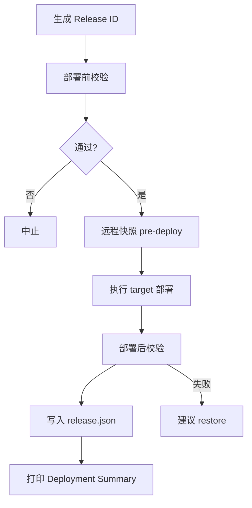

# OPS-005 — Release Manager

**Status:** Complete  
**Date:** 2026-07-05  
**Milestone:** Infrastructure Alpha (final task)

---

## 结论

每次生产部署现在都必须经过 **Release Manager**。系统会自动生成 **Release ID**、写 `release.json`、做部署前/后校验，并保留可回滚快照。基础设施里程碑到此结束，后续回到产品开发。

| 项目 | 结果 |
|------|------|
| Release ID | ✅ 每次部署自动生成 |
| release.json | ✅ 本地 + 生产双份存档 |
| 部署前校验 | ✅ git clean / backup / 目标确认 |
| 部署后校验 | ✅ nginx / 关键 URL / 服务状态 |
| 按 ID 回滚 | ✅ `release-restore.mjs` |
| 实机验证 | ✅ `REL-20260705043901-nginx-52ce7cd7` 部署成功 |

---

## Release ID 格式

```
REL-<UTC时间>-<target>-<git短哈希>
```

示例：`REL-20260705043901-nginx-52ce7cd7`

---

## 标准部署命令

```bash
# 生产 nginx 配置（需确认）
node scripts/deploy-production.mjs nginx --yes

# 本地有未提交改动时（仅开发/紧急）
node scripts/deploy-production.mjs nginx --yes --allow-dirty

# 或用环境变量确认（脚本会先打印 Release ID）
DEPLOY_CONFIRM=REL-20260705043901-nginx-52ce7cd7 node scripts/deploy-production.mjs nginx
```

### 部署目标（target）

| Target | 作用 | 会改什么 |
|--------|------|----------|
| `nginx` | Nginx 配置 | rate-limit、vhost、security conf |
| `api` | Node 后端 | server.js、lib/、systemd、npm |
| `engines` | 引擎页 | `public/engines/*.html` 仅 HTML |
| `apsales` | 销售自动化 | AsiaPower workspace 脚本 |
| `finalize` | 收尾 | cron、upload-key、权限、env 默认值 |

**不再做** 全量 `public/` rsync（OPS-004 起已禁止）。

---

## 部署流程



### 部署前校验（pre-deploy）

| 检查项 | 说明 |
|--------|------|
| `git_clean` | 工作区须干净；或加 `--allow-dirty`（警告） |
| `target` | 必须是合法 target |
| `changed_files` | 列出本次计划同步的源文件 |
| `target_confirmation` | 必须 `--yes` 或 `DEPLOY_CONFIRM=<Release ID>` |
| `backup_check` | SSH 到生产跑 `backup-inventory-site.sh`，记录 tar 路径 |

### 部署后校验（post-deploy）

| 检查项 | 适用 target |
|--------|-------------|
| `nginx_verification` | nginx、api |
| `critical_url_check` | nginx、api、engines（`verify-production.mjs`） |
| `services_active` | 全部（nginx + inventory-site） |

---

## release.json 结构

路径：

- 本地：`releases/<RELEASE_ID>/release.json`
- 生产：`/root/.openclaw/workspace/inventory-site/releases/<RELEASE_ID>/release.json`

字段：

| 字段 | 含义 |
|------|------|
| `release_id` | Release ID |
| `git_commit` / `git_branch` | 部署时 Git 状态 |
| `deploy_target` | nginx / api / engines / apsales / finalize |
| `remote` | SSH 目标 |
| `timestamp` | ISO 时间戳 |
| `changed_files` | 计划变更的源文件列表 |
| `validation.pre` / `validation.post` | 每项检查 pass/fail/warn |
| `recovery` | 备份路径、快照目录、restore 命令 |

---

## 按 Release ID 回滚

```bash
RESTORE_CONFIRM=REL-20260705043901-nginx-52ce7cd7 \
  node scripts/release-restore.mjs REL-20260705043901-nginx-52ce7cd7
```

回滚逻辑：

1. 读取 `release.json`（本地优先，否则 SSH 读生产）
2. 从 `snapshots/` 恢复该 target 涉及的远程路径
3. nginx/api target 会 reload/restart 服务
4. 全站大回滚仍用 `deploy/inventory-site-scripts/RESTORE.md` + backup tar

快照目录：`/root/.openclaw/workspace/inventory-site/releases/<ID>/snapshots/`

---

## 新增/修改文件

| 文件 | 作用 |
|------|------|
| `scripts/lib/release-manager.mjs` | Release Manager 核心模块 |
| `scripts/deploy-production.mjs` | 集成 pre/post 校验 + release.json |
| `scripts/release-restore.mjs` | 按 Release ID 恢复 |
| `.gitignore` | 忽略 `releases/`（本地 release 记录不入库） |

---

## 首次实机验证

```
Release ID:   REL-20260705043901-nginx-52ce7cd7
Target:       nginx
Git commit:   52ce7cd78c0e72b75d4a723b180b7a3bc300815d
Validation:   pass
Backup:       asia-power-backup-20260705-043903.tar.gz
```

---

## 与 OPS-004 的关系

- **OPS-004**：拆分部署 target，去掉 blind `public/` rsync  
- **OPS-005**：在 OPS-004 之上加 Release Manager 包装层  
- `finalize` target 保留 OPS-004 完整逻辑（cron、env key、权限）

---

## 下一步

**停止基础设施工作。** 回到产品功能开发；今后所有生产变更走 Release Manager 标准流程。
