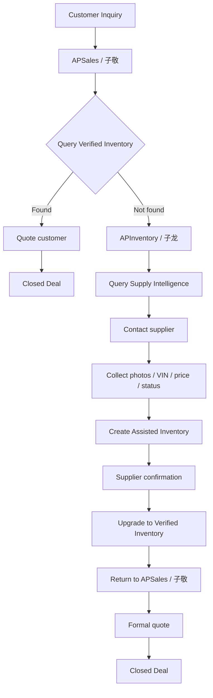

# AsiaPower Inventory Source Model

Date: 2026-07-05

Scope: knowledge and inventory design only. This document does not change website code, generate pages, or publish inventory.

## Core Principle

AsiaPower must separate four different concepts:

- **Engine Knowledge** is static knowledge.
- **Verified Inventory** is sellable inventory.
- **Assisted Inventory** is pending-confirmation inventory.
- **Supply Intelligence** is internal supply lead intelligence.

Do not mix them.

Most operational risk comes from treating an internal clue as public stock. The source layer must always be visible to 子龙/APInventory and 子敬/APSales before any item is shown or quoted.

## 1. Three Inventory Source Layers

### Layer 1: Verified Inventory

Definition:

Verified Inventory is inventory that has been confirmed and is allowed to appear on the public AsiaPower website.

Sources:

- Supplier directly uploads through the website.
- APInventory/子龙 has reviewed and approved an assisted record.
- Inventory has enough confirmed photos, specs, status, and supplier context to support public display.

Characteristics:

- Can be publicly displayed.
- Can be used for customer quotes.
- Can enter website inventory pages.
- Can be linked from engine knowledge pages and SEO landing pages.

Examples:

- Approved half-cut record with stock ID, photos, engine code, model, year, and public slug.
- Supplier-uploaded truck cab approved by APInventory.
- QXB/imported record that has passed review and is approved for display.

### Layer 2: Assisted Inventory

Definition:

Assisted Inventory is inventory that did not come through a formal website upload, but was provided by suppliers through WeChat groups, WhatsApp, images, Excel files, voice notes, chat messages, or similar channels. 子龙/APInventory helps structure it into a candidate inventory record.

Sources:

- WeChat group photos.
- Supplier WhatsApp messages.
- Supplier Excel sheets.
- Batch photo folders.
- APInventory manual structuring.
- QXB-like import workflows before final confirmation.

Characteristics:

- Semi-structured.
- Needs supplier confirmation.
- Not yet safe for public display unless explicitly approved.
- Can become Verified Inventory after review.

Examples:

- Supplier sends 12 photos of a Hyundai ix35 half-cut in a WeChat group.
- Supplier sends an Excel list of engines without photos.
- Supplier sends photos and approximate model/year but no confirmed VIN.

### Layer 3: Supply Intelligence

Definition:

Supply Intelligence is internal information that suggests who may have supply, but it is not confirmed inventory.

Sources:

- 子龙/APInventory reads supplier conversations while acting as supplier assistant.
- WeChat group discussions mention a yard may have a model.
- WhatsApp/social messages imply a supplier often handles certain engines.
- Historical supplier behavior suggests likely stock.
- Market intelligence reports identify possible supply clusters.

Characteristics:

- Internal only.
- Cannot be publicly displayed.
- Cannot be directly quoted.
- Must be followed up and confirmed before becoming Assisted or Verified Inventory.

Examples:

- “Supplier A often has G4KD engines.”
- “A WeChat group mentioned a yard with several Hyundai/Kia half-cuts.”
- “A supplier said last month they could source Isuzu 4JB1, but no current item was confirmed.”

## 2. Public Display Rules

| Source layer | Public display allowed? | Rule |
|---|---:|---|
| Verified Inventory | Yes | Can appear on website inventory pages and public search. |
| Assisted Inventory | No by default | Can appear publicly only after APInventory approval converts it to Verified Inventory. |
| Supply Intelligence | No | Must never be written directly into public pages. |

Public pages must not show:

- unconfirmed supplier claims,
- “maybe available” stock,
- private chat-derived supply hints,
- supplier names or contact details unless explicitly approved,
- full VIN or sensitive supplier/customer data.

## 3. Direct Quote Rules

| Source layer | Direct quote allowed? | Rule |
|---|---:|---|
| Verified Inventory | Yes | Can be quoted, subject to final price/status check. |
| Assisted Inventory | No direct final quote | Can be discussed as “checking with supplier”; final quote requires confirmation. |
| Supply Intelligence | No | Only use to decide who to ask. Do not quote customers from this layer. |

子敬/APSales may use Assisted Inventory or Supply Intelligence to say:

> “Let me confirm current availability and price with the supplier.”

子敬/APSales must not say:

> “This item is available at this price.”

unless the item is Verified Inventory or the supplier has just confirmed it for the specific enquiry.

## 4. Supplier Confirmation Rules

| Source layer | Supplier confirmation required? | Notes |
|---|---:|---|
| Verified Inventory | Already confirmed | Still check status before final quote if time-sensitive. |
| Assisted Inventory | Yes | Needs supplier confirmation before public display or final quote. |
| Supply Intelligence | Yes | Needs conversion into Assisted Inventory first, then confirmation. |

Confirmation should include as many of these as possible:

- current availability,
- item photos,
- engine code,
- vehicle model/year,
- VIN or masked VIN evidence where appropriate,
- included parts/accessories,
- price basis,
- location,
- packing/shipping constraints,
- supplier permission to publish.

## 5. 子龙 vs 子敬 Usage

| Source layer | Primary user | Secondary user | Usage |
|---|---|---|---|
| Verified Inventory | 子敬/APSales | 子龙/APInventory | Sales quotes, website display, customer follow-up, SEO/product links. |
| Assisted Inventory | 子龙/APInventory | 子敬/APSales | Structuring, supplier confirmation, review queue, possible quote preparation after confirmation. |
| Supply Intelligence | 子龙/APInventory | 子敬/APSales | Internal sourcing leads, supplier lookup, “who might have this” search. |

### 子龙/APInventory

子龙 owns:

- structuring supplier-provided materials,
- converting raw supplier data into candidate records,
- confirming details with suppliers,
- approving or rejecting inventory for public display,
- maintaining source provenance.

### 子敬/APSales

子敬 owns:

- using Verified Inventory in customer conversations,
- asking 子龙 to check Assisted Inventory,
- using Supply Intelligence only as a lead to find supply,
- avoiding public or customer-facing claims from unconfirmed sources.

## 6. Conversion Between Layers

### Supply Intelligence -> Assisted Inventory

Trigger:

- A supply clue becomes specific enough to investigate.

Required action:

- 子龙 identifies supplier/contact.
- 子龙 requests current item details.
- A candidate inventory record is created with `source_layer = assisted`.

Example:

> “Supplier A may have G4KD” becomes “Supplier A sent photos of a 2010 Hyundai ix35 G4KD half-cut.”

### Assisted Inventory -> Verified Inventory

Trigger:

- Supplier confirms availability and provides enough structured details.

Required action:

- 子龙/APInventory reviews photos and data.
- Sensitive data is redacted.
- Public title, model, engine code, category, status, and media are validated.
- Record is approved for website display.

Example:

> WeChat photos + supplier confirmation become public stock `HCxxxxx`.

### Verified Inventory -> Assisted Inventory

Trigger:

- Stock status becomes uncertain.
- Supplier asks to pause display.
- Price/status is stale.

Required action:

- Remove or hide public listing.
- Move back to confirmation queue.

### Verified Inventory -> Archived / Sold

Trigger:

- Item sold, unavailable, duplicate, or invalid.

Required action:

- Mark status accordingly.
- Keep internal provenance.
- Do not continue quoting as available.

### Assisted Inventory -> Supply Intelligence

Trigger:

- Supplier cannot confirm current item, but general supplier capability remains useful.

Required action:

- Do not keep as candidate stock.
- Store only as internal sourcing lead.

## 7. Relationship To Engine Knowledge Schema

Engine Knowledge and Inventory Source Model are related but different.

### Engine Knowledge

Engine Knowledge answers:

- What is this engine?
- What models use it?
- What years/applications are known?
- What official specs are verified?
- What repair/FAQ/SEO knowledge exists?

It is static or slowly changing.

Example:

```text
engine:g4kd
engine_code: G4KD
applications: Hyundai ix35, Sonata, Kia Sportage
```

### Inventory Source Model

Inventory Source Model answers:

- Do we have a sellable item?
- Is it public?
- Can 子敬 quote it?
- Does it need supplier confirmation?
- Where did this supply signal come from?

It is operational and changes frequently.

Example:

```text
G4KD knowledge exists.
HC250504 is Verified Inventory.
A WeChat mention of another G4KD is Supply Intelligence until confirmed.
```

### How They Connect

Engine Knowledge may reference inventory summaries, but it must not turn unconfirmed inventory into public facts.

Recommended separation:

- `knowledge/engines/*.json`: stable engine knowledge.
- Verified inventory records: public catalog/inventory system.
- Assisted inventory records: APInventory review queue.
- Supply intelligence records: internal sourcing intelligence only.

An engine knowledge page can say:

> “AsiaPower handles G4KD sourcing and has linked inventory records when available.”

It should not say:

> “G4KD is available now”

unless that statement is backed by Verified Inventory.

## 8. Explicit Definitions

### Engine Knowledge Is Static Knowledge

Engine Knowledge contains engine facts, applications, verified specs, FAQ, SEO metadata, and references.

It is not stock.

### Verified Inventory Is Sellable Inventory

Verified Inventory is confirmed, public, sales-ready inventory.

It can be shown on the website and used in quotes.

### Assisted Inventory Is Pending-Confirmation Inventory

Assisted Inventory is structured by AsiaPower from supplier-provided materials, but it still needs confirmation before public display or final quote.

It belongs in APInventory workflows, not public pages.

### Supply Intelligence Is Internal Supply Lead Intelligence

Supply Intelligence helps 子龙 and 子敬 know who to ask.

It is not stock, not public, and not quotable.

## 9. Hard Rules

1. Do not write Supply Intelligence directly into public pages.
2. Do not display unconfirmed inventory as real stock.
3. Do not quote from Supply Intelligence.
4. Do not quote Assisted Inventory as available until supplier confirmation.
5. Do not let SEO pages imply availability unless backed by Verified Inventory.
6. Do not expose supplier/private chat details publicly.
7. Do not mix engine identity with stock status.

## 10. Recommended Metadata Fields For Future Inventory Records

Future inventory-related records should include:

```json
{
  "source_layer": "verified | assisted | supply_intelligence",
  "public_display_allowed": true,
  "direct_quote_allowed": true,
  "supplier_confirmation_required": false,
  "source_channel": "website_upload | wechat_group | whatsapp | excel | qxb_import | manual_review | social_intel",
  "source_owner": "apinventory",
  "sales_owner": "apsales",
  "confirmation_status": "confirmed | pending | rejected | stale",
  "linked_knowledge_id": "engine:g4kd",
  "linked_engine_code": "G4KD"
}
```

These fields should remain operational metadata. They should not replace engine knowledge identity fields.

## Final Position

AsiaPower should treat supplier information as a pipeline:

```text
Supply Intelligence -> Assisted Inventory -> Verified Inventory -> Public catalog / Sales quote
```

Only the final layer is public and directly quotable.

This protects AsiaPower from publishing unconfirmed stock, overpromising to customers, exposing private supplier intelligence, and confusing static engine knowledge with sellable inventory.

## 11. Customer Inquiry Workflow



Workflow explanation:

1. Customer enquiry enters through 子敬/APSales.
2. 子敬 first checks Verified Inventory because it is public, confirmed, and quote-ready.
3. If Verified Inventory exists, 子敬 prepares the quote and manages customer follow-up through close.
4. If Verified Inventory does not exist, 子敬 asks 子龙/APInventory to find supply.
5. 子龙 searches Supply Intelligence, contacts suppliers, collects photos, VIN, price, and current status.
6. Once supplier data is structured, it becomes Assisted Inventory.
7. After supplier confirmation and APInventory review, the record upgrades to Verified Inventory.
8. 子龙 returns the confirmed inventory result to 子敬.
9. 子敬 sends the formal quote and owns the customer relationship through deal close.

Agent boundaries:

- 子敬 never directly accesses WeChat groups.
- 子龙 never directly quotes customers.
- 子敬 owns customer experience, quotation communication, follow-up, and closing.
- 子龙 owns supply chain work, inventory confirmation, supplier communication, and supply intelligence.
- The two agents communicate through the Inventory API. They do not directly share business logic.

## 12. Operational KPI

### 子龙（APInventory）

KPI:

1. New Supply Intelligence count
2. Intelligence -> Assisted conversion rate
3. Assisted -> Verified conversion rate
4. Average Verified confirmation time
5. Average sourcing time
6. Supplier activity level
7. High-quality supplier growth rate

### 子敬（APSales）

KPI:

1. Inquiry response time
2. Verified Inventory close rate
3. Assisted sourcing success rate
4. Quotation success rate
5. WhatsApp reply rate
6. Customer deal cycle
7. Repeat purchase rate

AsiaPower 的核心目标不是增加库存数量，而是持续提高：

```text
Supply Intelligence
-> Assisted Inventory
-> Verified Inventory
-> Quotation
-> Closed Deal
```

这一整条链路的转化效率。
